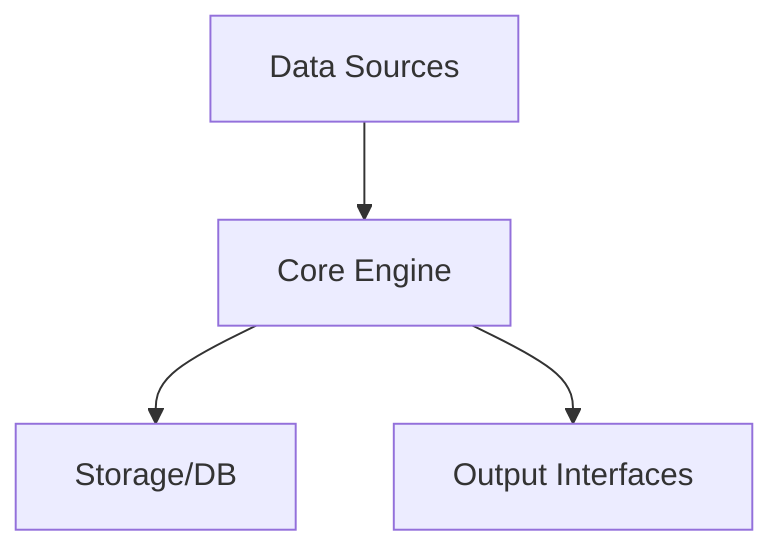

#Architecture Document - {{PROJECT_NAME}}

This document details the high-level architecture and design of {{PROJECT_NAME}}.

##System Overview
{{PROJECT_NAME}} is built using a modular architecture with clean separation of concerns.

##Key Components
- **Core Engine:** Contains the main business and execution logic.
- **Data Layer:** Handles files, databases, or stream feeds.
- **API / Interface:** Exposes methods and interfaces for users and systems.

##Data Flow

