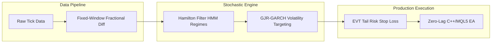

# Stochastic HMM Market Regime Detection & Execution Engine

[ English ] | [ [Versión en Español](docs/README_ES.md) ]

---

## Executive Summary

> [!NOTE]
> **Core Objective:** Build an institutional-grade quantitative framework to classify latent market volatility regimes using Hidden Markov Models (HMM) and execute zero-lag signals in MetaTrader 5 via C++/MQL5.

| Metric / Dimension      | Specification                                                             |
| :---------------------- | :------------------------------------------------------------------------ |
| **Stochastic Model**    | Hamilton Filter Hidden Markov Model (HMM) + Merton Jump Diffusion         |
| **Volatility Model**    | GJR-GARCH(1,1) Asymmetric Conditional Variance Forecasting                |
| **Execution Engine**    | Zero-Lag Policy C++/MQL5 MetaTrader 5 Expert Advisor                      |
| **Validation Protocol** | Combinatorial Purged Cross-Validation (CPCV) with Purging & Embargo       |
| **Risk Management**     | Corwin-Schultz Liquidity Estimator + Extreme Value Theory (EVT) Stop Loss |
| **Primary Stack**       | Python (Pandas, Arch, Scikit-Learn, SciPy), C++, MQL5, MetaTrader 5       |

---

## Mathematical Formulation

The regime transition probability is governed by the Hamilton Markov matrix:

$$P(S_t = j \mid S_{t-1} = i) = p_{ij}$$

The asymmetric conditional variance is modeled via GJR-GARCH(1,1):

$$\sigma_t^2 = \omega + (lpha + \gamma I_{t-1}) \epsilon_{t-1}^2 + eta \sigma_{t-1}^2$$

Where $I_{t-1} = 1$ if $\epsilon_{t-1} < 0$, capturing leverage effects during volatile market downturns.

---

## System Architecture

---

## Key Results

1. **Regime Separation:** Statistically significant differentiation between High Volatility (Mean-Reverting) and Low Volatility (Trending) states.
2. **Zero Data Leakage:** Evaluated under CPCV purging and embargo protocols to eliminate look-ahead bias.
3. **Zero-Lag Parity:** Strict mathematical parity between Python research output and MQL5 production execution.
