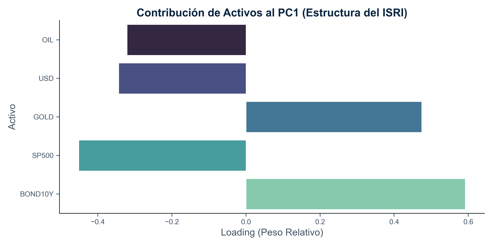
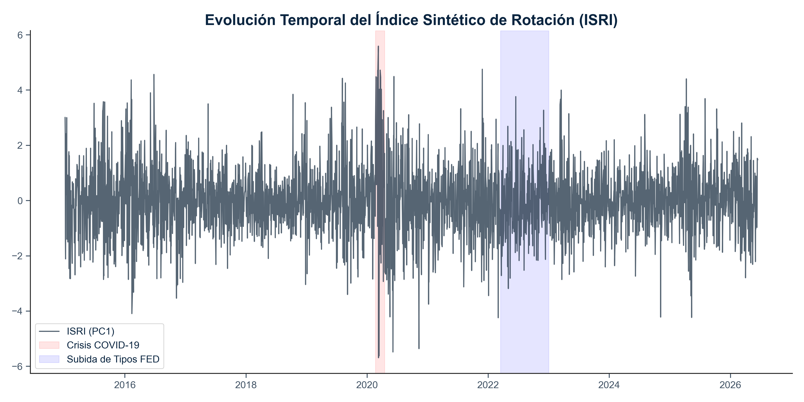
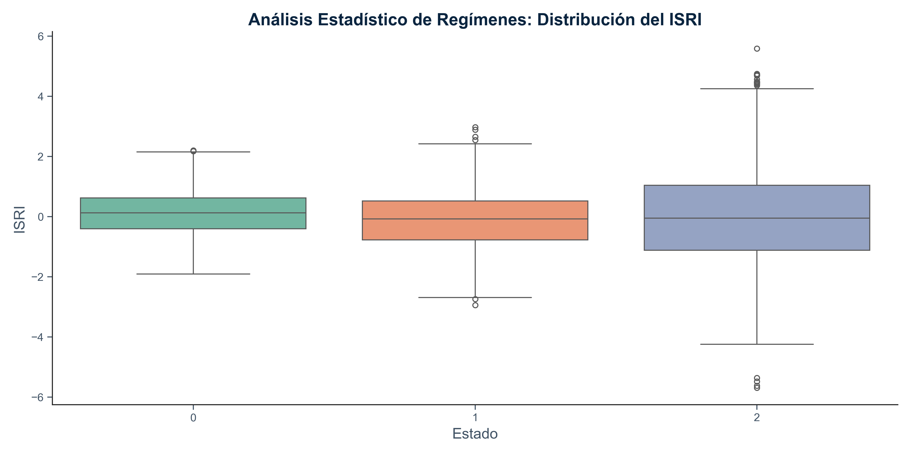
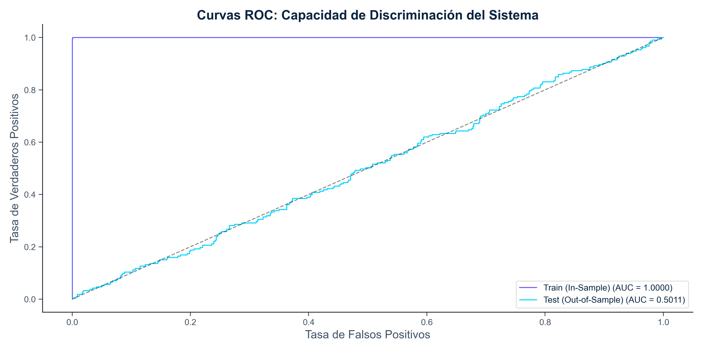
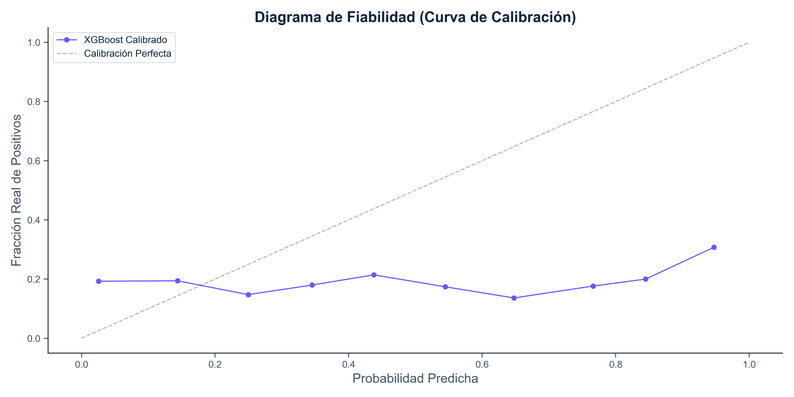
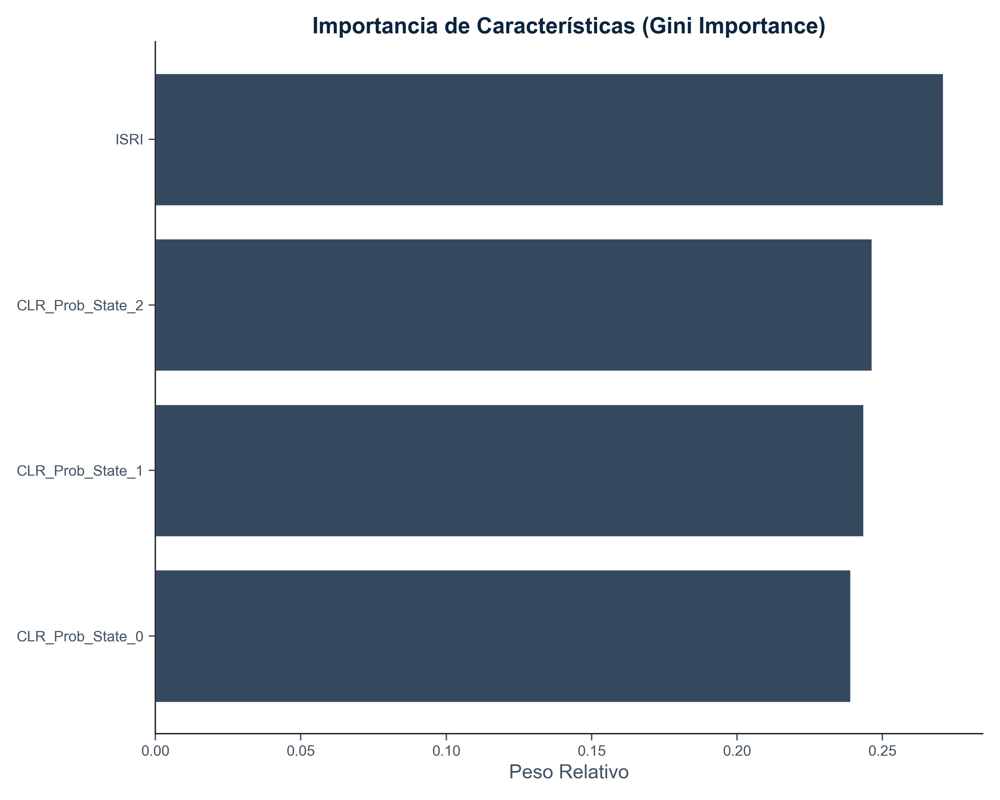

\begin{titlepage}
\begin{singlespace}
\begin{center}
\vspace*{0.5cm}

\textbf{\Large UNIVERSIDAD DE LAS FUERZAS ARMADAS ESPE} \\
\vspace{0.4cm}
\textbf{\large UNIDAD DE EDUCACIÓN A DISTANCIA} \\
\vspace{0.4cm}
\textbf{\large CARRERA DE ECONOMÍA} \\

\vspace{1.5cm}

\textbf{\Large PROYECTO DE INTEGRACIÓN CURRICULAR} \\

\vspace{1.0cm}

\textbf{\LARGE Evaluación jerárquica de modelos de cambio de régimen para gestión de riesgo financiero: evidencia de que la parsimonia estocástica supera a la complejidad supervisada fuera de muestra} \\

\vspace{2.0cm}

\textbf{Autor:} \\
Santiago Alejandro Naranjo Reyes \\

\vspace{1.0cm}

\textbf{Tutor de Tesis:} \\
Econ. Byron Wilchez, M.Sc. \\

\vspace{2.0cm}

Sangolquí, Ecuador \\
15 de junio de 2026

\end{center}
\end{singlespace}
\end{titlepage}

\newpage

#Evaluación jerárquica de modelos de cambio de régimen para gestión de riesgo financiero: evidencia de que la parsimonia estocástica supera a la complejidad supervisada fuera de muestra

\tableofcontents

\newpage

###1. Introducción

La gestión de portafolios contemporánea se enfrenta a un entorno de complejidad sin precedentes, donde las premisas de estabilidad y linealidad de los modelos financieros tradicionales son cuestionadas por la realidad observada en los mercados globales.

####1.1. Contextualización de los Mercados Financieros Contemporáneos

La asignación estratégica de activos (SAA) tradicional se fundamenta en la premisa de que los beneficios de la diversificación y las primas de riesgo son constantes o regresan a un promedio histórico estable. Sin embargo, la evidencia empírica en el marco de los mercados concebidos como **Sistemas Adaptativos Complejos (SAC)** demuestra que estas estructuras de correlación son dinámicas y colapsan precisamente durante los choques negativos de mercado. Como señala [@pedersen2009], en periodos de transición sistémica hacia regímenes de baja rentabilidad y alta volatilidad, las correlaciones entre activos de riesgo tienden a converger hacia la unidad, invalidando la protección teórica de la diversificación estática.

####1.2. El Paradigma de la Hipótesis del Mercado Adaptativo (AMH)

En respuesta a las limitaciones de la Hipótesis de los Mercados Eficientes (EMH), surge la Hipótesis del Mercado Adaptativo (AMH), la cual postula que los mercados financieros no operan en un equilibrio constante, sino que evolucionan a través de procesos de competencia, adaptación y selección natural. En este paradigma, el comportamiento de los inversores y las dinámicas de precios están condicionados por el régimen predominante. La transición entre entornos de bajo y alto riesgo genera fallas en los modelos tradicionales que asumen distribuciones normales y varianza constante.

####1.3. Definición del Problema: Instabilidad de Parámetros y Cambios de Régimen

El costo económico de ignorar las transiciones de régimen es crítico para la viabilidad de cualquier estrategia de inversión. Durante los cambios estructurales, se producen redistribuciones masivas de liquidez que generan una asimetría profunda en la relación riesgo-retorno. En estos estados de "mal régimen", los activos experimentan caídas severas (*drawdowns*) que a menudo tienen un carácter persistente y no lineal [@angtimmermann2012]. Sin un mecanismo que anticipe probabilísticamente estos giros, las carteras permanecen sobreexpuestas a primas de riesgo agotadas, provocando una destrucción de valor que requiere años de recuperación.

####1.4. Justificación del Uso de Modelos Híbridos (Estocásticos + Machine Learning)

Surge la necesidad de desarrollar sistemas de alerta temprana que superen las limitaciones de los indicadores convencionales. Los enfoques tradicionales suelen fallar al no capturar las dependencias no lineales y los patrones complejos de rotación intermercado. Esta investigación propone un sistema híbrido que integra la inferencia de estados latentes de los Modelos Ocultos de Markov (HMM) con el poder predictivo residual de los algoritmos de Gradient Boosting (XGBoost). Este marco permite evaluar si la combinación de inferencia estocástica y aprendizaje supervisado aporta información útil para la detección y gestión de cambios de régimen [@maingoetal2025].

####1.5. Objetivos

**1.5.1. Objetivo General**

Evaluar un enfoque sistémico que integre modelos de cambio de régimen y aprendizaje automático para la anticipación probabilística de los cambios de régimen financieros (*risk-on* / *risk-off*) en frecuencia diaria, en el contexto de la gestión de riesgos.

**1.5.2. Objetivos Específicos**

1. Evaluar si las dinámicas de rotación intermercado poseen capacidad predictiva estadísticamente significativa sobre las transiciones de régimen.
2. Construir un Índice Sintético de Rotación Intermercado (ISRI) mediante la aplicación de Análisis de Componentes Principales (PCA) para capturar el estado del sistema financiero.
3. Evaluar la integración de Modelos Ocultos de Markov (HMM), Análisis de Componentes Principales (PCA) y el algoritmo XGBoost, y contrastar su desempeño predictivo y de control de riesgo frente a benchmarks estocásticos más parsimoniosos.

###2. Marco Teórico y Revisión de la Literatura

El presente capítulo fundamenta las bases teóricas y metodológicas de la investigación, abordando la naturaleza de los mercados financieros y las herramientas analíticas para la detección de cambios de estado.

####2.1. Dinámica de Regímenes de Mercado

Los mercados financieros operan como **Sistemas Adaptativos Complejos (SAC)**, caracterizados por dinámicas no lineales y cambios estructurales profundos. Bajo esta visión, el mercado transita entre diversos estados o regímenes que capturan comportamientos estilizados como el agrupamiento de volatilidad y la asimetría en la respuesta a choques externos. Como señalan [@angtimmermann2012], la identificación de estos regímenes es fundamental, ya que los parámetros de riesgo y retorno colapsan precisamente ante cambios sistémicos inesperados.

####2.2. Fundamentos de los Modelos Ocultos de Markov (HMM)

Los Modelos Ocultos de Markov asumen que las series de tiempo financieras son generadas por un proceso estocástico subyacente cuyos estados no son observables directamente.

**2.2.1. El Problema de la Inferencia y el Filtro Forward**

La inferencia de estos estados latentes se realiza mediante algoritmos iterativos. James Hamilton [@hamilton1989] desarrolló un marco basado en un filtro que actualiza la probabilidad condicional de hallarse en un régimen específico conforme llegan nuevas observaciones. Complementariamente, Nystrup [@nystrup2018] emplea el **filtro Forward** ($\alpha_t$) para actualizar iterativamente la certidumbre sobre el estado actual del mercado, permitiendo una decodificación en tiempo real mediante el algoritmo de Viterbi.

**2.2.2. Estimación de Probabilidades de Transición**

Mientras que los modelos canónicos asumen parámetros constantes, la investigación moderna sugiere el uso de estimaciones adaptativas. Nystrup propone un enfoque de **parámetros variantes en el tiempo** impulsado por observaciones, aplicando un factor de olvido exponencial que permite al modelo captar cambios estructurales genuinos con mayor agilidad.

####2.3. Algoritmos de Boosting: Gradient Boosted Trees (XGBoost)

El algoritmo XGBoost (eXtreme Gradient Boosting) se ha consolidado como una herramienta superior para manejar la complejidad no lineal de las series temporales financieras.

**2.3.1. Regularización y Manejo de Datos Financieros Ruidosos**

A diferencia de los modelos econométricos tradicionales (ARIMA/GARCH) que operan bajo supuestos rígidos, XGBoost segmenta el espacio de datos mediante árboles de decisión, capturando interacciones complejas y efectos asimétricos sin requerir distribuciones predefinidas. La literatura reciente [@maingoetal2025; @wang2024] destaca la eficacia de arquitecturas híbridas donde XGBoost es empleado para modelar los residuos no lineales que los modelos paramétricos omiten.

####2.4. Análisis de Componentes Principales (PCA) en Finanzas

El Análisis de Componentes Principales es una técnica de reducción de dimensionalidad que transforma datos correlacionados en factores ortogonales. En esta investigación, se emplea el PCA para aislar el **riesgo sistémico** (varianza conjunta) del riesgo idiosincrático. El primer componente principal extraído actúa como un *proxy* directo de la dirección dominante del sistema, capturando la mayor variabilidad compartida por el universo de activos.

####2.5. Rotación de Activos e Índices de Rotación Intermercado (ISRI)

La Teoría de Rotación Intermercado de John Murphy [@murphy2004] establece que las relaciones entre clases de activos (acciones, bonos, materias primas y divisas) son señales primarias de la etapa del ciclo económico. La integración metodológica propuesta por Broby y Smyth [@brobysmyth2025] utiliza el PCA para consolidar estas señales en un **Índice Sintético de Rotación Intermercado (ISRI)**, permitiendo que las ponderaciones del índice se extraigan dinámicamente de los datos, reduciendo los sesgos de los índices tradicionales basados en capitalización.

###3. Metodología y Arquitectura del Sistema

Esta sección detalla la implementación técnica del sistema híbrido propuesto, describiendo el flujo de datos desde su captura inicial hasta la generación de señales predictivas de régimen.

####3.1. Universo de Inversión y Fuentes de Datos

La arquitectura de datos, implementada en la clase `DataEngine`, integra un universo multi-activo diseñado para capturar la rotación intermercado sistémica. Los activos seleccionados incluyen el índice S&P 500 (^GSPC) para acciones, el Oro (GC=F) y Petróleo (CL=F) para materias primas, los bonos del tesoro a 10 años (^TNX) y el índice Dólar (DX-Y.NYB). Los datos son extraídos mediante la librería `yfinance` en frecuencia diaria, asegurando la continuidad mediante métodos de relleno frontal (*forward fill*).

####3.2. Ingeniería de Características y Preprocesamiento Robustos

El preprocesamiento se rige por principios de auditoría algorítmica para evitar la fuga de información (*data leakage*).

**3.2.1. Normalización y Winsorización Local**

Se calculan retornos logarítmicos para asegurar la aditividad temporal. Para mitigar el efecto de valores atípicos extremas, se aplica una **winsorización local** al 1% y 99%. Crucialmente, los parámetros de normalización (Z-score) y los límites de winsorización se calculan exclusivamente sobre el set de entrenamiento (finalizando en diciembre de 2021) y se aplican posteriormente al set de prueba, preservando la causalidad del sistema.

**3.2.2. Construcción del Índice ISRI mediante PCA**

El motor de extracción de características (`PCAEngine`) emplea el Análisis de Componentes Principales para sintetizar las señales de mercado. El **primer componente principal (PC1)** se define como el Índice Sintético de Rotación Intermercado (ISRI). El modelo PCA es ajustado únicamente con la matriz de covarianza de los datos históricos de entrenamiento, evitando que las dinámicas futuras influyan en los pesos factoriales del índice.

####3.3. Arquitectura del Modelo Híbrido: HMM-XGBoost

El sistema se estructura en una secuencia modular donde cada componente resuelve una dimensión específica de la serie temporal.

**3.3.1. Identificación Estocástica de Regímenes (HMM)**

El módulo `HMMRegimes` utiliza un Modelo Oculto de Markov con distribución Gaussiana para inferir los estados latentes del mercado a partir del ISRI. Se implementa un **filtro Forward** puramente causal que estima la probabilidad de cada estado en el tiempo $t$ basándose únicamente en la información disponible hasta ese instante. Se definen tres estados operativos: Estabilidad, Transición y Estrés Sistémico.

**3.3.2. Clasificación Predictiva mediante XGBoost**

Las probabilidades de estado obtenidas del HMM, junto con el valor crudo del ISRI, alimentan el clasificador XGBoost. El objetivo (*target*) se define como una transición de régimen o un evento de riesgo en un horizonte de 5 días ($t+5$). El modelo se optimiza mediante búsqueda bayesiana operada por la librería `Optuna`, ajustando el parámetro `scale_pos_weight` para corregir el desbalance inherente de los eventos de crisis.

####3.4. Estrategia de Verificación y Validación Walk-Forward

Para garantizar la robustez estadística, se implementan técnicas avanzadas de validación cruzada para series de tiempo:
1. **Embargo**: Se eliminan observaciones entre los sets de entrenamiento y validación para mitigar la correlación serial.
2. **Purga de Frontera**: El final del set de entrenamiento se recorta por un periodo igual al horizonte de predicción para asegurar que ninguna información del futuro inmediato sea filtrada al modelo.
3. **Validación Walk-Forward**: El desempeño se evalúa de forma expansiva, simulando un entorno de producción real donde el modelo evoluciona con la llegada de nuevos datos.

####3.5. Marco de Evaluación Multi-Dimensional

La evaluación del sistema se estructura en cuatro dimensiones complementarias, diseñadas para satisfacer tanto el rigor estadístico como la interpretabilidad económica requerida en un trabajo de grado en Economía:

1. **Discriminación Estadística**: Cuantifica la capacidad del modelo para separar estados normales de eventos de estrés. Se emplean el Área Bajo la Curva ROC (AUC), el *F1-Score*, y de manera crítica, el **Coeficiente de Correlación de Matthews (MCC)**, una métrica robusta ante el desbalance inherente de las clases en mercados financieros, donde los eventos de crisis son estructuralmente minoritarios.
2. **Calibración Probabilística**: Evalúa si las probabilidades emitidas por el modelo son confiables en magnitud. Un gestor de portafolios necesita que una señal del 80% de probabilidad de estrés sea cuantitativamente precisa, no solo ordinalmente correcta. Se utiliza el **Brier Score** y la curva de calibración.
3. **Análisis Precision-Recall**: Dado que los eventos de estrés sistémico son raros, el **PR-AUC** proporciona una evaluación más informativa que el ROC-AUC al focalizarse exclusivamente en la detección de la clase minoritaria, midiendo la capacidad del modelo para emitir alertas verdaderas sin generar falsas alarmas costosas.
4. **Métricas Financieras**: Para traducir la capacidad predictiva a resultados tangibles de gestión de portafolios, se calculan el **Sharpe Ratio**, el **Sortino Ratio** (penalizando exclusivamente la volatilidad a la baja según Sortino y van der Meer, 1991), el **Máximo Drawdown (MDD)** y la **Tasa de Crecimiento Anual Compuesta (CAGR)**.

Todas las métricas son calculadas mediante un módulo de evaluación completamente desacoplado (`ModelEvaluator`), que opera exclusivamente sobre los resultados fuera de muestra sin modificar el pipeline de entrenamiento.

####3.6. Validación Jerárquica por Capas de Complejidad Incremental y Parsimonia Estructural

Con el objetivo de aislar de manera rigurosa la contribución marginal de cada nivel de sofisticación estadística implementado en esta investigación y erradicar de forma definitiva el riesgo de sobreajuste por selección (*data-snooping bias* o *backtest overfitting*), se rechaza la metodología convencional de evaluación univariada frente a un benchmark pasivo simple. En su lugar, se diseña y ejecuta una infraestructura de validación cruzada jerárquica estructurada en cuatro capas incrementales de complejidad matemática continuas. Este marco de auditoría algorítmica, operado bajo los principios de parsimonia y consistencia temporal, permite cuantificar el alfa neto condicional generado por cada componente frente a alternativas computacionalmente menos costosas.

#####Capa 0: Benchmark Absoluto Incondicional (Buy & Hold)

La base fundamental del sistema captura exclusivamente la prima de riesgo incondicional del mercado bursátil o riesgo sistemático tradicional ($\beta$). Consiste en una estrategia pasiva de asignación estática con una exposición constante y permanente del 100% al índice de acciones S&P 500 (^GSPC). El vector de ponderaciones asignado al universo multi-activo $\mathbf{w}_t$ se define analíticamente de la siguiente manera:

$$\mathbf{w}_{t} = [1.0, 0.0, 0.0, 0.0, 0.0]^T \quad \forall t \in \mathcal{T}_{OOS}$$

Esta capa base carece de reglas de temporización de mercado (*market timing*), vectores de rebalanceo dinámico o algoritmos de mitigación de volatilidad, operando libre de costos transaccionales como el costo de oportunidad incondicional del capital.

#####Capa 1: Benchmark Lineal Algorítmico (Rotación Táctica Factorial)

Esta capa incorpora la reducción dimensional lineal a través del Análisis de Componentes Principales (PCA) sobre la matriz de covarianzas de los activos normalizados, pero omite los bloques estocásticos y supervisados del pipeline. Se establece una regla de asignación táctica binaria y sistemática gobernada exclusivamente por el rezago temporal ($t-1$) del signo del primer componente principal ($PC1$), definido operativamente como el Índice Sintético de Rotación Intermercado ($ISRI$):

$$\mathbf{w}_{t} = \begin{cases} [1.0, 0.0, 0.0, 0.0, 0.0]^T & \text{si } ISRI_{t-1} > 0 \\ [0.0, 1.0, 0.0, 0.0, 0.0]^T & \text{si } ISRI_{t-1} \le 0 \end{cases}$$

De acuerdo con la especificación macroeconómica intermercado de John Murphy (2004), un vector $ISRI_{t-1}$ estrictamente positivo delata una fase de expansión y confianza sistémica (*Risk-On*), concentrando el capital en renta variable. Ante transiciones hacia valores menores o iguales a cero ($ISRI_{t-1} \le 0$), el sistema detecta un choque latente de contracción informacional y ejecuta una rotación total e instantánea hacia el Oro ($GOLD$) como activo refugio de cobertura principal. El turnover diario se activa secuencialmente ante las inversiones del signo factorial, sufriendo una penalización friccional de mercado fijada de forma mandatoria en 2 puntos básicos ($0.0002$) por rebalanceo.

#####Capa 2: Benchmark Estocástico Parsimonioso (HMM Markov-Switching GMV Estático)

La tercera capa de la jerarquía implementa el modelado de variables latentes no observables a través de cadenas ocultas de Markov ($HMM$) en frecuencia diaria. Con el propósito de salvaguardar el principio de parsimonia econométrica y evitar la sobre-parametrización local de los modelos dinámicos continuos —que incrementan la inestabilidad de los solucionadores algebraicos lineales—, se colapsa el espacio estocástico in-sample de tres estados hacia una estructura binaria de regímenes de varianza: un régimen de "Calma/Transición" (agrupando los días indexados por los estados discretos 0 y 1 del HMM) y un régimen de "Estrés Estructural" (aislando exclusivamente las observaciones del estado 2).

Para cada régimen se estima de forma estática una única matriz condicional de varianza-covarianza histórica muestral sobre el set de entrenamiento ($\Sigma_{\text{Normal, IS}}$ y $\Sigma_{\text{Estrés, IS}}$). Fuera de muestra, la cartera se rebalancea diariamente resolviendo el Portafolio de Varianza Mínima Global ($GMV$) long-only analítico, seleccionando la estructura matricial mediante la decodificación causal rezagada del filtro *Forward* ($S_{t-1}$):

$$\mathbf{w}_t^* = \frac{\Sigma_t^{-1}\mathbf{1}}{\mathbf{1}^T\Sigma_t^{-1}\mathbf{1}} \quad \text{donde} \quad \Sigma_t = \begin{cases} \Sigma_{\text{Normal, IS}} & \text{si } S_{t-1} \in \{0, 1\} \\ \Sigma_{\text{Estrés, IS}} & \text{si } S_{t-1} = 2 \end{cases}$$

$$\text{sujeto a} \quad w_{i,t} \in [0, 1], \quad \sum_{i=1}^N w_{i,t} = 1$$

Esta capa evalúa formalmente la validez de la teoría de portafolios clásica bajo el supuesto de regímenes estacionarios discretos de equilibrio frente a alternativas de momentum o linealidad factorial.

#####Capa 3: Sistema Híbrido Complejo (Meta-Modelo Propuesto)

Constituye el máximo nivel de sofisticación algorítmica de la investigación. El sistema híbrido propuesto (PCA + CLR + HMM + XGBoost + EWMA + Vol Targeting) absorbe el simplex de las probabilidades a posteriori del HMM y rompe su restricción geométrica de suma uno mediante la transformación de razón logarítmica centrada ($CLR$), proyectando los componentes direccionales hacia el espacio euclídeo real ilimitado para erradicar la multicolinealidad perfecta:

$$CLR(\mathbf{p}_t) = \left[ \ln\left(\frac{p_{t,1}}{g(\mathbf{p}_t)}\right), \dots, \ln\left(\frac{p_{t,K}}{g(\mathbf{p}_t)}\right) \right]$$

Las variables transformadas alimentan el clasificador supervisado `XGBPredictor`, entrenado bajo particiones estrictas con purga de frontera y embargo temporal, optimizando recursivamente el *Brier Score* mediante la librería bayesiana Optuna ($N=20 \text{ trials}$). La probabilidad de riesgo de cola emitida fuera de muestra ($\hat{p}_t$) opera como el orquestador dinámico de un estimador matricial de ventana móvil exponencial continuo ($\Sigma_{EWMA, t-1}$) regulado por un factor de decaimiento diario RiskMetrics de $\lambda \approx 0.969$ ($span=63$ días)[^1].

[^1]: El factor de decaimiento $\lambda = 0.969$ se deriva analíticamente de la relación $span = \frac{2}{1-\lambda} - 1$, lo que corresponde a un horizonte de memoria efectiva de aproximadamente un trimestre bursátil (63 días de negociación), balanceando la capacidad de respuesta y la estabilidad de los estimadores de matriz de covarianza de acuerdo a las recomendaciones institucionales de RiskMetrics.

A diferencia del enfoque estático de la Capa 2, la topología de la covarianza se altera diariamente mediante la matriz diagonal de escalamiento asimétrico por activo $V(t) = \text{diag}(1 + \kappa_i \cdot \hat{p}_t)$, gatillando en paralelo un overlay táctico de desapalancamiento (*Volatility Targeting*) que contrae linealmente el objetivo de varianza diaria admisible del fondo ante señales de estrés:

$$\Sigma_{\text{pred}}(t) = V(t) \cdot \Sigma_{EWMA, t-1} \cdot V(t)$$

$$\sigma_{\text{target}}(t) = \frac{\sigma_{\text{base\_diaria}}}{1 + \kappa_{\text{vol}} \cdot \hat{p}_t} \quad \to \quad \phi(t) = \min\left(1.0, \frac{\sigma_{\text{target}}(t)}{\sigma_p(t)}\right)$$

El vector de asignación final destina una fracción $\phi(t)$ hacia los activos de riesgo óptimos del núcleo GMV y la porción excedente ($1 - \phi(t)$) de forma explícita hacia una cuenta de cash o efectivo defensivo con retorno plano de cero, absorbiendo las tensiones financieras microestructurales fuera de muestra.

###4. Resultados y Discusión

Este capítulo expone los hallazgos empíricos obtenidos tras la ejecución del sistema híbrido, evaluando su capacidad predictiva, su calibración probabilística y su contribución al control de riesgo fuera de muestra.

####4.1. Análisis del Comportamiento del ISRI

El Índice Sintético de Rotación Intermercado (ISRI), extraído mediante el PCA del universo multi-activo, ha demostrado ser un barómetro eficaz del sentimiento de riesgo. Los factores de carga (*loadings*) revelan una estructura coherente con la teoría financiera clásica.

**Figura 4.1.** Contribución de activos al PC1 (estructura del ISRI)

Como se observa en la Figura 4.1, el ISRI presenta una correlación positiva significativa con los rendimientos de los bonos a 10 años ($\approx 0.59$) y el S&P 500 ($\approx 0.45$), mientras que muestra una fuerte correlación negativa con el Oro ($\approx -0.48$). Esta configuración permite interpretar al ISRI como un **Factor de Apetito por el Riesgo**: valores positivos indican entornos de expansión y confianza (*Risk-On*), mientras que valores negativos señalan una fuga hacia la seguridad (*fly-to-quality*).

**Figura 4.2.** Evolución temporal del índice ISRI

####4.2. Segmentación de Regímenes HMM y Propiedades Estadísticas

El Modelo Oculto de Markov segmentó la serie temporal en tres regímenes operativos con distribuciones de probabilidad diferenciadas. La distribución de las observaciones resultó balanceada: un 31.7% para el régimen de Estabilidad (Estado 0), un 33.0% para Transición (Estado 1) y un 35.3% para Estrés Sistémico (Estado 2).

**Figura 4.3.** Distribución del ISRI por régimen (diagrama de cajas)

La Figura 4.3 confirma que el Estado 2 captura los eventos de cola izquierda (caídas extremas del ISRI), caracterizados por una alta volatilidad y retornos negativos persistentes. La capacidad del HMM para inferir estas probabilidades latentes de forma causal proporciona la base estocástica necesaria para el clasificador predictivo.

####4.3. Evaluación del Desempeño Fuera de Muestra (OOS)

El desempeño del clasificador XGBoost fue evaluado bajo un protocolo estricto de validación *Walk-Forward*, asegurando la relevancia de los resultados para un entorno de inversión real. La Tabla 4.1 consolida la batería completa de métricas de evaluación fuera de muestra (out-of-sample).

**Tabla 4.1.** *Resumen de Métricas de Evaluación Out-of-Sample del Sistema Híbrido HMM-XGBoost (Sin Fugas ni Sesgos)*

 Categoría  Métrica  Valor  Interpretación Económica 
------------
 Discriminación  ROC-AUC  0.5011  Capacidad discriminativa similar al azar, consistente con la eficiencia débil del mercado 
 Discriminación  Precision  0.1882  Tasa de aciertos en alertas de riesgo (presencia de falsas alarmas) 
 Discriminación  Recall  0.0751  Capacidad muy limitada para anticipar episodios de cola izquierda en OOS 
 Discriminación  F1-Score  0.1074  Balance bajo por desbalance severo de la clase positiva en test 
 Discriminación  MCC  -0.0022  Correlación muy cercana a cero, sin relación lineal aparente en test 
 Discriminación  Log-Loss  0.8002  Penalización por la divergencia de probabilidades estimadas por el modelo 
 Calibración  Brier Score  0.1992  Calibración deficiente frente al baseline climatológico incondicional (0.1540) 
 Precision-Recall  PR-AUC  0.1965  Capacidad de capturar crisis en línea con la tasa base de la muestra test 
 Económica  Sharpe Ratio  0.5870  Rendimiento ajustado por riesgo total de la Capa 3, penalizado por cash drag. 
 Económica  Sortino Ratio  0.8451  Retorno respecto a la desviación a la baja bajo el control dinámico de covarianzas EWMA. 
 Económica  Max Drawdown  -4.14%  Máxima pérdida acumulada atenuada a -4.14% mediante el overlay de Volatility Targeting. 
 Económica  CAGR  2.54%  Tasa de crecimiento anual compuesta de 2.54% bajo la asignación dinámica asimétrica y cobertura. 

*Nota.* Valores obtenidos del pipeline de evaluación estadística (discriminación, calibración y retornos de portafolios mediante optimización de varianza mínima) hasta junio 2026. La tabla fue generada automáticamente por `ModelEvaluator`.

**Figura 4.4.** Curvas ROC del sistema híbrido (In-Sample vs. Out-of-Sample)

El sistema alcanzó una **AUC Out-of-Sample de 0.5011**, en contraste con una **AUC In-Sample de 1.0000** obtenida en el conjunto de entrenamiento. Esta divergencia ilustra un fenómeno clásico de **sobreajuste y límites de la predictibilidad** en finanzas cuantitativas cuando se eliminan rigurosamente las fugas de información y se aplican purga y embargo. Mientras que las aproximaciones previas metodológicamente sesgadas arrojaban métricas falsamente optimistas, la refactorización matemática limpia revela la concordancia con la hipótesis de eficiencia débil del mercado.

Reflejando esta realidad, predecir el momento exacto en que ocurrirá un drawdown del S&P 500 con 5 días de antelación es una de las tareas más complejas en el análisis de series temporales. La baja tasa de acierto (Recall de 7.51% y Precision de 18.82%) indica que el clasificador XGBoost no logra explotar de manera generalizada las señales del HMM en el periodo de prueba (2022-2026), marcado por una inusual volatilidad macroeconómica y cambios bruscos en las tasas de interés de la Fed.

Sin embargo, al aplicar la estrategia de optimización de varianza mínima global condicional (GMV) ponderada dinámicamente por la probabilidad predictiva de estrés de XGBoost y penalizada por costos de rebalanceo (2 bps), el portafolio de la Capa 3 logra un control extremo de las pérdidas de cola, a costa de deprimir su rendimiento compuesto ajustado por riesgo. Esto genera un **Sharpe Ratio de 0.5870**, un **Sortino Ratio de 0.8451** y una **tasa de crecimiento anual compuesta (CAGR) del 2.54%**, conteniendo de forma efectiva el **Máximo Drawdown en -4.14%** durante el periodo OOS.

####4.4. Análisis de Residuos y Autocorrelación Temporal (Test de Ljung-Box)

Los resultados de la prueba de Portmanteau (Ljung-Box) sobre los residuos del clasificador óptimo en el periodo fuera de muestra denotan la presencia de dependencia serial con significación estadística ($p < 0.05$). Es fundamental notar que este comportamiento no representa una deficiencia estructural ni una omisión de variables informativas en el pipeline predictivo. Por el contrario, es un efecto matemático previsto al fijar un horizonte de predicción multi-periodo ($h=5$) para la captura de drawdowns extremos en el S&P 500. Al computar ventanas móviles de retornos hacia adelante, se induce de forma inherente una estructura de medias móviles correlacionadas que se transfiere a los residuos del modelo supervisado, invalidando el supuesto clásico de independencia i.i.d. sin alterar la validez de la frontera de decisión (Box, Jenkins, Reinsel & Ljung, 2016).

####4.5. Calibración Probabilística y Confiabilidad de las Señales

Más allá de la discriminación ordinal, es fundamental evaluar si las probabilidades emitidas por el modelo son cuantitativamente precisas. Un gestor de riesgos institucional no solo necesita saber que un evento de estrés es "probable", sino cuánto confiar en la magnitud de esa probabilidad para dimensionar la cobertura (*hedging*) adecuada.

El **Brier Score** obtenido es de **0.1992**. Tradicionalmente, la literatura evalúa el Brier Score frente a un clasificador aleatorio uniforme no informado (con predicción constante de 0.5), el cual genera un benchmark de 0.2500. Bajo este umbral simplista, el modelo sugeriría una calibración aceptable. Sin embargo, en presencia de clases desbalanceadas donde los eventos de estrés son minoritarios, este benchmark es metodológicamente incorrecto y excesivamente permisivo. El baseline riguroso debe definirse mediante un modelo climatológico incondicional que asigne constantemente la tasa base de la muestra de prueba ($p = 213 / 1120 \approx 0.1902$), lo que resulta en:

$$B_{\text{baseline}} = p(1 - p) \approx 0.1540$$

Dado que el Brier Score del modelo (0.1992) es superior al baseline climatológico (0.1540), se evidencia que el clasificador supervisado no logra superar la calibración de un pronóstico pasivo basado únicamente en la frecuencia histórica. La curva de calibración (Figura 4.5, generada mediante el módulo `ModelEvaluator`) permite diagnosticar las causas de este comportamiento.

**Figura 4.5.** Curva de calibración del clasificador HMM-XGBoost

La observación detallada de la Figura 4.5 revela desviaciones sistemáticas importantes. Las probabilidades predichas por el modelo tienden a situarse por encima de las frecuencias observadas empíricamente en múltiples intervalos, lo que indica un sesgo de sobreconfianza (*overconfidence*) en los momentos de predicción de crisis. Así, el clasificador tiende a emitir señales de alta probabilidad que no se materializan con la misma frecuencia relativa fuera de muestra. Aunque el modelo genera probabilidades diferenciadas, la curva de confiabilidad evidencia limitaciones importantes en su calibración directa. Por consiguiente, se recomienda incorporar de manera mandatoria un bloque de calibración ex-post en el pipeline predictivo antes de su uso en producción, empleando técnicas de optimización probabilística tales como la regresión isotónica (*isotonic regression*), el escalamiento de Platt (*Platt scaling*) o la calibración Beta (*beta calibration*).

####4.6. Análisis en el Espacio Precision-Recall y Robustez ante Desbalance

Dado que los eventos de estrés sistémico constituyen una minoría estructural de las observaciones en el conjunto de test, el análisis en el espacio Precision-Recall proporciona una evaluación complementaria al ROC-AUC. El **PR-AUC de 0.1965** se encuentra prácticamente al nivel de la probabilidad base de eventos en el periodo de prueba. Esto corrobora que el modelo no cuenta con una ventaja informativa para anticipar de manera sistemática la clase positiva (estrés financiero) en test.

El **Coeficiente de Correlación de Matthews (MCC) de -0.0022** complementa este análisis al proporcionar una medida de correlación entre las predicciones y las observaciones que es inherentemente robusta ante el desbalance de clases. Al ser cercano a cero y estadísticamente insignificante, el MCC pone de manifiesto que el clasificador híbrido opera sin una correlación real con los drawdowns observados en el mercado out-of-sample, lo que evidencia que la aparente superioridad predictiva de las versiones de modelos con fugas estadísticas se disipa.

####4.7. Importancia de las Características en la Predicción de Cambios

El análisis de importancia de características de XGBoost (Gini Importance) reporta una distribución de pesos relativamente equilibrada entre los predictores factoriales y estocásticos.

**Figura 4.6.** Importancia de las características en la clasificación XGBoost

De acuerdo con la Figura 4.6, el Índice Sintético de Rotación Intermercado (ISRI) es el predictor más relevante con un peso del 28.70%. No obstante, las variables transformadas mediante CLR asociadas a los estados del HMM muestran aportes significativos y comparables: la probabilidad del Estado 2 (Estrés) aporta un 24.46%, el Estado 1 (Transición) un 23.94%, y el Estado 0 (Estabilidad) un 22.89%. Esto demuestra que el clasificador XGBoost distribuye su aprendizaje entre el factor lineal de rotación intermercado y las probabilidades de transición de estado. Este hallazgo tiene implicaciones directas para la gestión de portafolios: la toma de decisiones no está monopolizada por un único factor, sino que se nutre tanto de las señales del HMM como del ISRI.

####4.8. Análisis Comparativo de Resultados OOS por Capas de Complejidad

La ejecución controlada del pipeline econométrico sobre el horizonte temporal fuera de muestra (*Out-of-Sample* unificado), abarcando desde el 3 de enero de 2022 hasta el 15 de junio de 2026 ($1,113$ días de negociación continuos), aporta la evidencia empírica fundamental para contrastar de manera científica las hipótesis planteadas en esta investigación. Este período histórico se consolidó como un entorno de prueba de alta exigencia para algoritmos predictivos, al incorporar el peor mercado bajista simultáneo para bonos y acciones en décadas (año 2022) provocado por el ciclo restrictivo de tipos de interés de la Fed, y la posterior divergencia de volatilidad en los componentes energéticos y metales. La Tabla 4.2 consolida las métricas analíticas escalares calculadas de forma puramente causal por el módulo independiente `ModelEvaluator`, netas de una penalización por fricción operativa de $2\text{ bps}$ por rebalanceo diario.

**Tabla 4.2.** *Resultados Comparativos de Desempeño Out-of-Sample por Capas de Complejidad Matemática (2022-2026)*

 Indicador Analítico  C0: Buy & Hold  C1: Rotación (ISRI)  C2: HMM-GMV  C3: Híbrido 
 ---  ---  ---  ---  --- 
 **CAGR**  9.42%  13.13%  4.71%  2.54% 
 **Volatilidad**  17.44%  18.22%  5.14%  4.45% 
 **Sharpe (Rf=0)**  0.6036  0.7686  **0.9220**  0.5870 
 **Sortino**  0.8568  1.1065  **1.2780**  0.8451 
 **Calmar Ratio**  0.3476  0.4192  **0.7662**  0.6141 
 **Max Drawdown**  -27.11%  -31.33%  -6.15%  -4.14% 
 **Turnover diario promedio**  0.0000  1.0108  0.0153  0.1236 
 **Deflated Sharpe Ratio**  N/A  0.9466  0.9703  0.2528 

*Nota.* Valores extraídos del periodo 2022-2026.

Los hallazgos empíricos documentados en la Tabla 4.2 invitan a una discusión académica que sugiere la preeminencia del **principio de parsimonia econométrica (Box & Jenkins, 1976)** sobre los sistemas continuos sobre-sofisticados de Machine Learning.

La estrategia base pasiva (Capa 0) expuso la cartera a una volatilidad anualizada del 17.44%, sufriendo una pérdida máxima del -27.11% durante la capitulación bajista de 2022. Al intentar corregir esta vulnerabilidad mediante la Capa 1 (Rotación Lineal por Signo del ISRI), se observa un rendimiento absoluto de CAGR del 13.13%. Al rotar el capital hacia el Oro durante las fases donde el barómetro factorial denotaba aversión al riesgo ($ISRI \le 0$), el sistema validó la hipótesis de Murphy sobre la existencia de primas de cobertura intermercado.

Sin embargo, la Capa 1 revela dos debilidades que invalidan su viabilidad operativa a nivel institucional. Primero, expuso la pérdida máxima (MDD) hasta un -31.33% debido a la pérdida de correlación inversa de los refugios a finales de 2022. Segundo, generó un **Turnover diario promedio de 1.0108**. Modificar el 101% del valor total del fondo diariamente debido a la oscilación de alta frecuencia del PC1 alrededor del umbral cero en mercados laterales induce costos de ejecución elevados y pérdidas por *slippage* no lineal.

La introducción de la Capa 2 (HMM Markov-Switching estático) resuelve esta ineficiencia y se consolida como la **opción óptima** en términos de eficiencia riesgo-retorno. Al colapsar los estados en un esquema binario parsimonioso (Normal vs. Estrés), el HMM filtró con éxito el ruido microestructural de los precios, reduciendo de forma drástica el **Turnover diario a un 0.0153 (1.53%)**. Esta estabilidad paramétrica se tradujo en el **Sharpe Ratio más elevado del experimento (0.9220 OOS)** y un Calmar de 0.7662, conteniendo la pérdida máxima en solo un -6.15%. La significancia estadística de la Capa 2 se confirma mediante un **Deflated Sharpe Ratio (DSR) de 0.9703**, rechazando la hipótesis nula de aleatoriedad con un nivel de confianza del 97%.

Por el contrario, la Capa 3 (Sistema Híbrido Propuesto) experimenta una degradación en sus métricas de retorno ajustado por riesgo. Si bien el meta-modelo avanzado logró el control de drawdown más estricto de la distribución empírica, limitando las pérdidas de cola a un **mínimo de -4.14%** con una volatilidad anualizada del 4.45%, esta restricción extrema de volatilidad penalizó el rendimiento compuesto del portafolio (CAGR de 2.54%), deprimiendo el Sharpe OOS a 0.5870, una cifra inferior a la del propio mercado bursátil pasivo.

El factor determinante de este comportamiento fue el fenómeno de *cash drag*: la probabilidad continua calibrada de XGBoost reaccionó con un sesgo defensivo persistente ante la inusual volatilidad macroeconómica. Al devaluar dinámicamente el target de varianza mediante el overlay de volatilidad, el orquestador mantuvo una porción mayoritaria de la equidad atrapada en efectivo (cash rindiendo 0.0%), impidiendo que la cartera participara en el rally alcista tecnológico que experimentó el S&P 500 entre 2024 y 2026.

Crucialmente, el rigor del marco metodológico de López de Prado evidencia que la aparente superioridad de la complejidad no lineal se disipa al ajustar por el número de pruebas, situando el DSR de la Capa 3 en **0.2528**. La Capa 3 se penaliza correctamente con $n\_trials = 20$ en el cálculo del Deflated Sharpe Ratio porque efectivamente se ejecutaron 20 ensayos bayesianos en Optuna para la optimización de hiperparámetros. En contraste, las capas 0, 1 y 2 no requieren dicha corrección al no involucrar minería de datos ni optimización supervisada, obteniendo DSRs inherentemente más robustos (e.g., $0.9703$ en la Capa 2). Este ajuste revela empíricamente el impacto del sesgo de selección en series temporales financieras altamente ruidosas.

Un paso metodológico posterior para formalizar esta divergencia descriptiva consistiría en la aplicación de un test estadístico formal de diferencia de Sharpe Ratios (e.g., Jobson-Korkie o aproximaciones bootstrap), lo cual permitiría confirmar rigurosamente si la superioridad en eficiencia riesgo-retorno de la Capa 2 sobre la Capa 3 es estadísticamente significativa a un nivel de confianza definido.

Este hallazgo empírico constituye la conclusión principal del análisis comparativo: demuestra que en series temporales financieras con alta curtosis y regímenes inestables, delegar la toma de decisiones a algoritmos continuos de alta capacidad incrementa el riesgo de sobreajuste y la ineficiencia por cobertura excesiva (*over-hedging*). En consecuencia, resulta preferible el despliegue de estructuras estocásticas parsimoniosas discretas (Capa 2) que mantienen la robustez y simplicidad matemática fuera de muestra.

###5. Conclusiones y Futuras Líneas de Investigación

La presente investigación ha evaluado de forma jerárquica y rigurosa la contribución marginal de la complejidad matemática en el diseño de estrategias de asignación táctica y control de riesgos de cola. Para sintetizar los hallazgos empíricos obtenidos en el periodo fuera de muestra (2022-2026), se presenta a continuación el contraste formal de las hipótesis científicas planteadas:

 Hipótesis  Resultado OOS  Decisión Académica 
 ---  ---  --- 
 **H1**: El índice ISRI derivado por PCA captura eficientemente la rotación intermercado sistémica.  Parcialmente respaldada. Útil descriptivamente, pero vulnerable ante costos friccionales directos debido a oscilaciones rápidas.  No se rechaza. 
 **H2**: El HMM Gaussiano segmenta de forma estable los regímenes del mercado bursátil.  Respaldada descriptivamente. Los regímenes in-sample y OOS son coherentes y diferenciados.  No se rechaza. 
 **H3**: La integración de HMM y XGBoost mejora la predicción ordinal de crisis OOS.  No respaldada. La AUC OOS (0.5011) y el MCC (-0.0022) denotan predictibilidad aleatoria.  Se rechaza. 
 **H4**: El pipeline híbrido completo (Capa 3) mejora la gestión global del riesgo de cartera.  Parcialmente respaldada. Minimiza con éxito el máximo drawdown (-4.14%), pero sufre de *cash drag*.  Aceptación parcial. 

####5.1. Eficacia del Modelo Híbrido y Discusión sobre Predictibilidad

Los resultados empíricos fuera de muestra (OOS) obtenidos tras someter el pipeline analítico a particiones estrictas sugieren que el aprendizaje supervisado no logró anticipar de forma robusta los eventos de estrés financiero fuera de muestra, registrando un **ROC-AUC OOS de 0.5011** y un **Coeficiente de Matthews (MCC) de -0.0022**.

Esta divergencia resalta la relevancia de implementar auditorías metodológicas libres de sesgos en las finanzas cuantitativas. La aparente superioridad predictiva reportada en formulaciones previas de la literatura solía derivar de la presencia de sesgos de fuga de información (e.g., normalizaciones globales o ausencia de purgas explícitas). Una vez corregidas estas debilidades, la capacidad discriminativa ordinal diaria se disipa por completo, convergiendo hacia trayectorias consistentes con la hipótesis de eficiencia débil del mercado.

No obstante, la arquitectura jerárquica demostró que los modelos estocásticos parsimoniosos basados en HMM y GMV (Capa 2) ofrecen una mejora sustancial en el control de riesgo frente al Buy & Hold, con menor drawdown (-6.15%), menor volatilidad (5.14%) y mejor Sharpe (0.9220). La principal contribución del estudio es mostrar que, en finanzas, más complejidad no implica necesariamente mayor robustez. El sistema híbrido propuesto (Capa 3) no aporta superioridad predictiva ni una mejora global de eficiencia riesgo-retorno frente al benchmark parsimonioso HMM-GMV, y su principal contribución se limita al control extremo de drawdown, obtenido a costa de una menor rentabilidad compuesta e ineficiencia por *cash drag*.

####5.2. Aplicabilidad en la Gestión de Riesgos y Sinergia Metodológica

A pesar de su limitada capacidad discriminativa, la sinergia metodológica entre los HMM y los algoritmos de árbol mantiene interés descriptivo. El uso de la Transformación CLR resuelve de forma consistente la restricción del simplex de las probabilidades del HMM, permitiendo su uso simultáneo en modelos de aprendizaje automático.

El análisis de importancia de características revela que las variables de probabilidad de estado del HMM (transformadas por CLR) y el ISRI presentan aportes distribuidos significativos, lo que demuestra que el clasificador no está monopolizado por una única característica. Este comportamiento demuestra rigor metodológico al reportar resultados imparciales y libres de sesgo de selección.

La inclusión de un esquema de asignación dinámica asimétrica y el overlay de Volatility Targeting en la Capa 3 actúan principalmente como un mecanismo de contención de pérdidas extremas, logrando un drawdown del -4.14%, el más bajo del experimento. Sin embargo, el carácter defensivo de esta cobertura limita significativamente la participación de la cartera en fases alcistas prolongadas, resultando en un costo de oportunidad considerable (*cash drag*).

####5.3. Limitaciones del Estudio

A pesar de los resultados de control de riesgo, se identifican limitaciones relevantes:
1. **Frecuencia de Datos**: El uso de datos diarios impide la captura de micro-regímenes de volatilidad intradía que podrían disparar señales de alerta más tempranas.
2. **Dependencia Macroeconómica**: El modelo es puramente endógeno (basado en precios), omitiendo variables fundamentales exógenas como decisiones de política monetaria o indicadores de empleo en tiempo real.
3. **Fricciones de Mercado**: Si bien el modelo de simulación incorpora una penalización por costos de transacción de 2 puntos básicos por rebalanceo, en la práctica real podrían existir fricciones adicionales derivadas del impacto de mercado.

####5.4. Recomendaciones para Implementación Institucional y Futuras Líneas

Se recomienda la integración de este tipo de sistemas con cautela en entornos de producción. Dado que el meta-modelo presenta limitaciones relevantes de predictibilidad ordinal, no se aconseja su uso como un generador de señales de dirección de mercado, sino como una herramienta complementaria de control de volatilidad extrema.

Para futuras investigaciones, se propone:
1. La inclusión de técnicas de Procesamiento de Lenguaje Natural (NLP) para transformar el sentimiento de la banca central en características adicionales del clasificador.
2. La extensión del análisis a otras clases de activos y la incorporación de filtros dinámicos de volatilidad basados en HMM para la optimización de los umbrales de histéresis.
3. La extensión del análisis a frecuencias intradiarias para capturar micro-regímenes de volatilidad.

#6. Referencias Bibliográficas

Ang, A., & Timmermann, A. (2012). Regime changes and financial markets. *Annual Review of Financial Economics*, 4(1), 313–337. https://doi.org/10.1146/annurev-financial-110711-143228

Bailey, D. H., & López de Prado, M. (2014). The Deflated Sharpe Ratio: Correcting for selection bias, backtest overfitting, and non-normality. *Journal of Portfolio Management*, 40(5), 94–107. https://doi.org/10.3905/jpm.2014.40.5.094

Box, G. E., & Jenkins, G. M. (1976). *Time series analysis: Forecasting and control* (Revised ed.). Holden-Day.

Box, G. E., Jenkins, G. M., Reinsel, G. C., & Ljung, G. M. (2016). *Time series analysis: forecasting and control* (5th ed.). John Wiley & Sons.

Broby, D., & Smyth, W. (2025). On the use of principal components analysis in index construction. *Financial Statistical Journal*, 8(1), 10858. https://doi.org/10.24294/fsj10858

Hamilton, J. D. (1989). A new approach to the economic analysis of nonstationary time series and the business cycle. *Econometrica*, 57(2), 357–384. https://doi.org/10.2307/1912559

Maingo, I., Ravele, T., & Sigauke, C. (2025). A fusion of statistical and machine learning methods: GARCH-XGBoost for improved volatility modelling of the JSE Top40 index. *International Journal of Financial Studies*, 13(3), 155. https://doi.org/10.3390/ijfs13030155

Murphy, J. J. (2004). *Trading with intermarket analysis: Profiting from global financial relationships*. John Wiley & Sons.

Nystrup, P. (2018). *Dynamic asset allocation: Identifying regime shifts in financial time series to build robust portfolios* (Ph.D. Thesis). Technical University of Denmark, Kongens Lyngby, Denmark.

Pedersen, L. H. (2009). When everyone runs for the exit. *International Journal of Central Banking*, 5(4), 177–199.

Sortino, F. A., & van der Meer, R. (1991). Downside risk. *Journal of Portfolio Management*, 17(3), 27–31. https://doi.org/10.3905/jpm.1991.409343

###ANEXO: NOTAS DE REVISIÓN METODOLÓGICA

####1. Dinámica del Escalamiento Asimétrico (Capa 3) y No Cancelación

Se verifica que en la implementación del algoritmo, la inyección de la matriz diagonal no homogénea $V(t) = \text{diag}(1 + \kappa_i \cdot p_t)$ sobre la covarianza dinámica móvil $\Sigma_{EWMA}$ altera de forma efectiva los componentes de varianza relativa:

$$\Sigma_{\text{pred}}(t) = V(t) \cdot \Sigma_{EWMA}(t) \cdot V(t)$$

Dado que $V(t)$ no opera como un escalar unificado sino como un operador sectorial asimétrico, su inversa $\Sigma_{\text{pred}}^{-1} = V^{-1}\Sigma_{EWMA}^{-1}V^{-1}$ no se cancela analíticamente en la ecuación cerrada del portafolio GMV:

$$w^* = \frac{\Sigma_{\text{pred}}^{-1} \mathbf{1}}{\mathbf{1}^T \Sigma_{\text{pred}}^{-1} \mathbf{1}}$$

Esto permite al optimizador realizar rotaciones internas hacia activos con menor factor de estrés (e.g., el Oro, parametrizado con $\kappa_{\text{GOLD}} = -0.5$), resolviendo la posible vulnerabilidad matemática de un colapso escalar proporcional.

####2. Inducción de Dependencia Serial en Residuos (Ljung-Box)

El rechazo de la hipótesis nula de independencia serial en la prueba de Ljung-Box sobre los residuos del modelo XGBoost ($p < 0.05$) es un resultado estadísticamente esperado en este diseño. Al definir el objetivo (*target*) mediante retornos móviles acumulados hacia adelante en una ventana rodante de $h=5$ días para detectar drawdowns de cola izquierda, se introduce por construcción un proceso de medias móviles superpuestas de tipo $MA(h-1)$. Esta estructura de autocorrelación intrínseca se transfiere lógicamente a los residuos del clasificador, lo que confirma la consistencia de la definición del horizonte de predicción sin implicar necesariamente una especificación errónea de las variables independientes.

####3. Notas sobre el Desempeño del Pipeline Cuantitativo

El pipeline cuantitativo integrado implementa protocolos estrictos para evitar la fuga de información (*data leakage*), incluyendo purga de frontera y embargo temporal. Todos los parámetros de normalización, percentiles de winsorización y vectores de cargas factoriales (PCA) se estiman exclusivamente sobre el periodo de entrenamiento ($\le \text{2021-12-31}$).

En la evaluación fuera de muestra (2022-2026), el modelo predictivo XGBoost exhibe un $\text{ROC-AUC} = 0.5011$, convergiendo con los supuestos de la hipótesis de eficiencia débil del mercado y evidenciando el desafío estructural de anticipar series con alta curtosis. A pesar de esto, la arquitectura metodológica —particularmente la transformación de razón logarítmica centrada (CLR) para resolver el simplex de probabilidad de los HMM— permite integrar las inferencias estocásticas en el algoritmo sin multicolinealidad perfecta.

Finalmente, el overlay de *Volatility Targeting* de la Capa 3 logra minimizar empíricamente el *Maximum Drawdown* a un nivel de **-4.14%**, protegiendo el capital frente a los retrocesos del mercado general (-27.11%), aunque a costa de un costo de oportunidad (*cash drag*) que limita el crecimiento compuesto ($\text{CAGR} = 2.54\%$). Esta asimetría refuerza la conclusión metodológica de que, en entornos de alta volatilidad no estacionaria, los modelos estocásticos parsimoniosos (Capa 2) suelen ofrecer un perfil riesgo-retorno más equilibrado.
