#Plan de Ejecución Maestro (DMN-CFD): Sistema de Trading Cuantitativo Neuronal con Cambio de Régimen de Markov y Control de Fricciones OTC

Este documento detalla el blueprint operativo de nivel institucional para el desarrollo, optimización, validación cruzada e implementación en producción de una estrategia de **Time Series Momentum (TSMOM)** basada en **Redes de Momento Profundo (Deep Momentum Networks o DMN)** sobre **Contratos por Diferencia (CFDs)**.

El diseño integra un modelo de cambio de régimen de **Markov-Switching State-Space (M-SSSM)** para mitigar el desfase temporal de los indicadores y un esquema de optimización de carteras basado en la teoría de crecimiento óptimo de **Kelly regularizada por volatilidad de Yang-Zhang**, resolviendo analíticamente todas las inconsistencias dimensionales y desfases de escala temporal.

---

##Estructura General del Sistema (Pipeline de Datos a Ejecución)

```mermaid
graph TD
    A[Ingestión de Datos CFD: OHLC, Swaps, Spreads] --> B[Estimador Volatilidad Yang-Zhang Adaptativo]
    B --> C[Ingeniería de Atributos: Tensor u_i,t con MACD Logarítmico y Overnight Gap Rezagado]
    C --> D[Filtro M-SSSM Jerárquico de 3 Factores Sectoriales: Filtro de Kim por Fold]
    D --> E[Backbone Temporal DMN: LSTM L=63 + Positional Encoding + Causal Attention]
    E --> F[Modelado de Fricciones: Costos Transacción & Swaps Porcentuales Adaptados]
    F --> G[Función de Pérdida: Sharpe Diferenciable Bailey-Prado Exacto + EVaR con Annealing Cíclico]
    G --> H[Dimensionamiento de Posición: Sizing Vol Target Efectiva & CATSMOM con Floor Causales]
    H --> I[Ejecución & Control de Riesgos: CPCV Purga 147d, 10 Bloques & Socket API]
```

---

##Auditoría de Correcciones Matemáticas e Integración Dimensional

Para garantizar la estabilidad del optimizador y la viabilidad del capital en mercados OTC reales de CFDs, este plan de ejecución maestro adopta e implementa de manera estricta las soluciones a las inconsistencias y debilidades matemáticas detectadas en las fases de auditoría:
1.  **ERR-01 (MVRK Kelly Diaria):** Desanualización de la matriz de covarianza de Yang-Zhang ($V_{t, \, \text{diaria}} = \frac{1}{252} V_t$) para adecuarla a la escala de retornos diarios del Filtro de Kim.
2.  **ERR-02 (Carry Cost Porcentual):** Eliminación del multiplicador de precio nominal $P_{i, t}$ en el costo de swap overnight, previniendo el error de suma dimensional de retornos en $R_{p, t}^{\text{net}}$.
3.  **ERR-03 (Tensor de 12 Dimensiones):** Incorporación de la probabilidad condicional de régimen global de crisis ($\xi_{3, t}$) del M-SSSM y del overnight gap normalizado rezagado en el tensor de características de entrada de la DMN para completar exactamente las 12 dimensiones de $u_{i, t}$.
4.  **ERR-04 (Normalización de Swaps):** Escalamiento de las tasas de carry diarias utilizando la desviación estándar diaria ex-ante en lugar del estimador anualizado.
5.  **ERR-05 (Consistencia de Ventanas YZ y Extremo Corto):** Adaptación dinámica de las ventanas del estimador Yang-Zhang ($N_s$). Para el extremo corto ($s=1$), se reemplaza el retorno clásico de 1 día por el **overnight gap normalizado rezagado** ($Z_{i, t-1}^{(\text{gap})}$) con volatilidad ex-ante de 5 días para evitar la inestabilidad de la anualización de ventanas ultracortas y erradicar el *look-ahead bias*.
6.  **ERR-06 (Normalización Cross-Asset MACD):** Implementación de EMAs sobre log-precios divididos por la volatilidad de log-retornos para hacer el MACD comparable entre activos con precios nominales dispares.
7.  **ERR-07 (M-SSSM Jerárquico de 3 Factores Sectoriales):** Estructura jerárquica de dos niveles para evitar la rigidez y sobreidentificación de un factor simple síncrono. Permite dinámicas AR sectoriales independientes con ruidos condicionalmente independientes a través de una matriz de covarianza de proceso $Q^{(S_t^{\text{global}})}$ estrictamente diagonal.
8.  **ERR-08 (Identificabilidad de Escala y Signo M-SSSM):** Fijación estricta de la escala del modelo estableciendo la varianza de proceso del factor en Régimen 1 a la unidad ($Q_j^{(1)} = 1$ para cada factor $j$) e imponiendo una restricción de signo positivo en la carga del activo ancla SPX500 ($\lambda_{\text{SPX500}} > 0$).
9.  **ERR-09 (Optimización EVaR con Annealing Cíclico):** Introducción de un esquema de **Cyclic Cosine Annealing** y warmup de learning rate para evitar mínimos locales y la inestabilidad de gradientes EVaR en el entrenamiento temprano.
10. **ERR-10 (Coordinación de Escala de Riesgo y Target Efectivo):** Aplicación de una volatilidad objetivo efectiva ajustada por el factor de Kelly fraccionario ($\tau_{\text{efectivo}} = \phi \cdot \tau$) para evitar la infra-exposición de la cartera ante costos overnight de carry.
11. **ERR-11 (CPCV de Purga Extendida y Lookback LSTM):** Limitación del horizonte máximo de retornos de momentum a $s_{\max} = 126$ días combinada con un periodo de purga de **147 días** y división en **$N = 10$ bloques** de validación cruzada. Se fija el lookback del LSTM a **$L = 63$ días** para preservar una muestra de entrenamiento neta viable y evitar la subdeterminación del modelo.
12. **ERR-12 (Regularización y Piso CATSMOM Causal):** Introducción de un regularizador numérico $\epsilon = 0.1$ y recorte (clip) $[0.5, \, 2.0]$ sobre el factor de correlación $CF_t$, incorporando un floor $\delta_{\min, t}$ estimado mediante ventana rodante retrospectiva para evitar data leakage en producción.
13. **ERR-13 (Sharpe Diferenciable de Bailey-López de Prado Exacto):** Implementación del estimador de Sharpe en la pérdida utilizando los coeficientes teóricos exactos de corrección de sesgo por asimetría y curtosis leptocúrtica.

---

##Fase 1: Ingestión de Datos y Diseño del Universo de CFDs

La primera fase del plan consiste en adquirir y limpiar un universo diversificado de CFDs y construir un repositorio histórico libre de sesgo de supervivencia y *look-ahead bias*.

###1. Selección del Universo Multiactivo
El universo debe cubrir cuatro clases de activos globales de alta liquidez para maximizar el beneficio de la descorrelación de señales:
*   **Índices Bursátiles (Equity Indices):** SPX500, NAS100, DJI30, GER30, EU50, UK100, JPN225.
*   **Divisas (G10 FX Spot):** EUR/USD, USD/JPY, GBP/USD, AUD/USD, USD/CHF, USD/CAD.
*   **Materias Primas (Commodities):** Oro (XAU/USD), Plata (XAG/USD), Cobre, Petróleo Brent, Petróleo WTI, Gas Natural, Café, Azúcar, Trigo, Maíz y Soja.
*   **Renta Fija (Fixed Income):** US10Y (Bono del Tesoro de EE. UU. de 10 años) y BUND (Bono Soberano Alemán de 10 años).

###2. Resolución y Parámetros de Ingestión
*   **Resolución:** Velas diarias (Daily OHLC).
*   **Estructura de Datos Requerida:** Cada registro debe contener la tupla:

$$
\text{DataRow}_{i, t} = \left\{ O_{i, t}, \, H_{i, t}, \, L_{i, t}, \, C_{i, t}, \, \text{SwapLong}_{i, t}, \, \text{SwapShort}_{i, t}, \, \text{Spread}_{i, t} \right\}
$$

Donde:
*   $O_{i, t}, H_{i, t}, L_{i, t}, C_{i, t}$ son los precios diarios de apertura, máximo, mínimo y cierre del CFD $i$ en el día $t$.
*   $\text{SwapLong}_{i, t}, \text{SwapShort}_{i, t}$ son los valores de *overnight swap* expresados en puntos de cotización o porcentaje anualizado cobrados por el broker en el cierre de mercado de Nueva York (5:00 PM EST).
*   $\text{Spread}_{i, t}$ es el spread *bid-ask* promedio observado durante la última hora de la sesión.

---

##Fase 2: Ingeniería de Atributos (Feature Engineering)

La red neuronal DMN se entrena con representaciones normalizadas de tendencia, riesgo y costo. Para garantizar la causalidad temporal y evitar la fuga de información (*data leakage*), todas las características en el instante $t$ se calculan utilizando únicamente información disponible al cierre de la sesión de negociación del día $t-1$ (tiempo de feature estrictamente anterior al tiempo de decisión).

###1. Estimación de Volatilidad ex-ante mediante el Estimador de Rango de Yang-Zhang
Para reducir la inestabilidad de la cartera causada por *overnight gaps* en la cotización de los CFDs, se implementará el estimador de Yang y Zhang (2000) ($\sigma_{\text{YZ}}$), el cual es *drift-independiente* y hasta 8 veces más eficiente que el estimador *close-to-close* clásico. 
La varianza anualizada se denota por $\sigma_{\text{YZ}, i, t}^2(N)$ y la desviación estándar anualizada (volatilidad) por $\sigma_{\text{YZ}, i, t}(N)$. Para cada ventana de retrospectiva $N$, la varianza se estima como:

$$
\sigma_{\text{YZ}, i, t}^2(N) = \sigma_{O, i, t}^2(N) + k(N) \sigma_{C, i, t}^2(N) + (1 - k(N)) \sigma_{\text{RS}, i, t}^2(N)
$$

Donde:
*   $\sigma_{O, i, t}^2(N)$ es la varianza *close-to-open* (gaps de apertura) calculada en una ventana de $N$ días:
    
    $$
    \begin{aligned}
    \sigma_{O, i, t}^2(N) &= \frac{252}{N - 1} \sum_{s=t-N+1}^t \left( \ln\left( \frac{O_{i, s}}{C_{i, s-1}} \right) - \bar{o}_{i, t} \right)^2 \\[1em]
    \text{con} \quad \bar{o}_{i, t} &= \frac{1}{N} \sum_{s=t-N+1}^t \ln\left( \frac{O_{i, s}}{C_{i, s-1}} \right)
    \end{aligned}
    $$

*   $\sigma_{C, i, t}^2(N)$ es la varianza *open-to-close* (rango de la vela intradía) calculada en una ventana de $N$ días:
    
    $$
    \begin{aligned}
    \sigma_{C, i, t}^2(N) &= \frac{252}{N - 1} \sum_{s=t-N+1}^t \left( \ln\left( \frac{C_{i, s}}{O_{i, s}} \right) - \bar{c}_{i, t} \right)^2 \\[1em]
    \text{con} \quad \bar{c}_{i, t} &= \frac{1}{N} \sum_{s=t-N+1}^t \ln\left( \frac{C_{i, s}}{O_{i, s}} \right)
    \end{aligned}
    $$

*   $\sigma_{\text{RS}, i, t}^2(N)$ es el estimador de Rogers-Satchell, robusto ante derivas distintas de cero, calculado en una ventana de $N$ días:
    
    $$
    \sigma_{\text{RS}, i, t}^2(N) = \frac{252}{N} \sum_{s=t-N+1}^t \left[ \ln\left( \frac{H_{i, s}}{C_{i, s}} \right) \ln\left( \frac{H_{i, s}}{O_{i, s}} \right) + \ln\left( \frac{L_{i, s}}{C_{i, s}} \right) \ln\left( \frac{L_{i, s}}{O_{i, s}} \right) \right]
    $$

*   $k(N)$ es el factor de peso óptimo que minimiza analíticamente la varianza del estimador general:
    
    $$
    k(N) = \frac{0.34}{1.34 + \frac{N + 1}{N - 1}}
    $$

###2. Atributos de Entrada del Tensor ($u_{i, t}$)
Para cada CFD $i$ en el día $t$, se construye un vector de características de **exactamente 12 dimensiones** ($u_{i, t} \in \mathbb{R}^{12}$) para procesar la escala de riesgo y la estructura de costos de manera dimensionalmente consistente:
*   **Overnight Gap Normalizado Rezagado ($Z_{i, t-1}^{(\text{gap})}$) [1 variable]:** Para erradicar el *look-ahead bias* (el uso de la apertura $O_{i, t}$ antes de que ocurra en el día de decisión $t$, ERR-05), se utiliza el gap observado rezagado un día comercial, disponible al cierre de la sesión de ayer $t-1$:
    
    $$
    Z_{i, t-1}^{(\text{gap})} = \frac{\ln\left( O_{i, t-1} / C_{i, t-2} \right)}{\sigma_{\text{YZ}, i, t-1}(5) / \sqrt{252}}
    $$

*   **Retornos Normalizados por Volatilidad ($Z_{i, t}^{(s)}$) [5 variables]:** Calculados para horizontes temporales de mediano y largo plazo $s \in \{5\text{d}, 10\text{d}, 21\text{d}, 63\text{d}, 126\text{d}\}$ (limitando el horizonte máximo a 126 días para optimizar la purga de CPCV y evitar data leakage, ERR-11). Se utiliza una ventana de volatilidad ex-ante adaptada $N_s \in \{10, 15, 21, 63, 126\}$ respectivamente para evitar la mezcla de escalas:
    
    $$
    Z_{i, t}^{(s)} = \frac{\ln\left( C_{i, t} / C_{i, t-s} \right)}{\sigma_{\text{YZ}, i, t}^{(s)}(N_s) \sqrt{s / 252}}
    $$

*   **Filtros MACD Multiescala Normalizados ($MACD_{i, t}^{(k)}$) [3 variables]:** Obtenidos mediante la diferencia de Medias Móviles Exponenciales ($m_{i, t, \tau}^{\ln}$) sobre log-precios $\ln(C_{i, t})$ con vidas medias $\tau \in \{S_k, L_k\}$. Para evitar inestabilidades de escala ante regímenes cambiantes de volatilidad, la ventana de normalización de la desviación estándar de los log-retornos se adapta proporcionalmente a la longitud de la EMA lenta: $N_{\text{norm}, k} = \max(\lfloor 1.5 \times L_k \rfloor, 63)$ días.
    
    $$
    MACD_{i, t}^{(k)} = \frac{m_{i, t, S_k}^{\ln} - m_{i, t, L_k}^{\ln}}{\sigma_{N_{\text{norm}, k}, i, t}^{\text{log-return}}}
    $$
    
    Para los pares de escala y ventanas de normalización correspondientes:
    *   $(S_1, L_1) = (8, 24) \rightarrow N_{\text{norm}, 1} = 63$ días.
    *   $(S_2, L_2) = (16, 48) \rightarrow N_{\text{norm}, 2} = 72$ días.
    *   $(S_3, L_3) = (32, 96) \rightarrow N_{\text{norm}, 3} = 144$ días.

*   **Atributos de Costo de Carry CFD Normalizados ($S_{i, t}^{\text{long}}, S_{i, t}^{\text{short}}$) [2 variables]:** Tasas de swap diarias cobradas por el broker, normalizadas utilizando la volatilidad *diaria* ex-ante (es decir, $\sigma_{\text{YZ}, i, t}(N=21) / \sqrt{252}$) para mantener coherencia dimensional con los retornos normalizados $Z_{i, t}^{(s)}$ y evitar subestimar la desutilidad del apalancamiento ante el optimizador (corrección ERR-04):
    
    $$
    \begin{aligned}
    S_{i, t}^{\text{long}} &= \frac{\text{SwapLongRate}_{i, t} / 360}{\sigma_{\text{YZ}, i, t}(21) / \sqrt{252}} \approx 0.0441 \times \frac{\text{SwapLongRate}_{i, t}}{\sigma_{\text{YZ}, i, t}(21)} \\[1em]
    S_{i, t}^{\text{short}} &= \frac{\text{SwapShortRate}_{i, t} / 360}{\sigma_{\text{YZ}, i, t}(21) / \sqrt{252}} \approx 0.0441 \times \frac{\text{SwapShortRate}_{i, t}}{\sigma_{\text{YZ}, i, t}(21)}
    \end{aligned}
    $$

*   **Probabilidad de Régimen de Crisis Sistémica M-SSSM ($\xi_{3, t}$) [1 variable]:** Probabilidad condicional filtrada del régimen global de crisis/extrema volatilidad estimada por el Filtro de Kim bajo el modelo de factores sectoriales jerárquicos (ERR-07). Esto completa de forma exacta las 12 dimensiones del tensor y acopla el régimen global sistémico directamente a las capas de selección de variables (V-VSN) de la red neuronal.

---

##Fase 3: Filtro Estocástico de Cambio de Régimen Integrado (M-SSSM)

Para evitar el *phase lag* (retraso de fase) característico de las medias móviles y la posterior destrucción de la estructura de covarianza al pasar filtros deterministas antes de modelos de Markov, se implementa un **Markov-Switching Dynamic Factor Model (MS-DFM) Jerárquico**. Para capturar las divergencias reales entre clases de activos y unificar la lectura macro del tensor (ERR-07), el modelo se formula en dos niveles jerárquicos estructurados en 3 factores sectoriales comunes con cargas realistas.

###1. Reagrupación de Factores Sectoriales (ERR-07)
Los activos se agrupan en $J = 3$ factores condicionalmente independientes respecto a su dinámica en el proceso:
1.  **Factor 1 ($f_{t, \, 1}$ - Riesgo Sistémico):** Índices Bursátiles (SPX500, NAS100, DJI30, GER30, EU50, UK100, JPN225) y Divisas procíclicas de G10 FX (EUR/USD, GBP/USD, AUD/USD).
2.  **Factor 2 ($f_{t, \, 2}$ - Energía y Materias Primas Cíclicas):** Petróleo Brent, Petróleo WTI, Gas Natural y Cobre. Las materias primas agrícolas (Maíz, Trigo, Soja) y de carry de nicho (Café, Azúcar) se asignan a este factor con cargas libres y alta varianza.
3.  **Factor 3 ($f_{t, \, 3}$ - Refugio y Deflación):** Oro, Plata, Renta Fija (US10Y, BUND), USD/CHF y USD/JPY. Esto unifica activos con correlaciones empíricas consistentes en fases de *risk-off*.

###2. Estructura Jerárquica del Modelo
*   **Nivel 1 (Global):** Existe un único proceso de Markov global discreto $S_t^{\text{global}} \in \{1, 2, 3\}$ (Régimen 1: Bullish, Régimen 2: Range, Régimen 3: Crisis/Bearish) que captura el estado macro general de la cartera.
*   **Nivel 2 (Sectorial):** Cada factor sectorial latente $f_{t, \, j}$ ($j \in \{1, 2, 3\}$) evoluciona según la ecuación de transición condicional al estado global:
    
    $$
    f_{t, \, j} = F_j^{(S_t^{\text{global}})} f_{t-1, \, j} + u_{t, \, j}
    $$
    
    Los ruidos del proceso sectoriales $\mathbf{u}_t = [u_{t, 1}, u_{t, 2}, u_{t, 3}]^\top$ son condicionalmente independientes entre sí, modelados mediante una matriz de covarianza de proceso $Q^{(S_t^{\text{global}})}$ diagonal:
    
    $$
    Q^{(S_t^{\text{global}})} = \text{diag}\left( Q_1^{(S_t^{\text{global}})}, \, Q_2^{(S_t^{\text{global}})}, \, Q_3^{(S_t^{\text{global}})} \right)
    $$

Los log-retornos diarios observados $y_{i, t}$ de cada activo $i$ perteneciente al sector $j(i)$ se modelan a través de las ecuaciones de medida individuales:

$$
y_{i, t} = \lambda_i f_{t, \, j(i)} + e_{i, t}, \quad e_{i, t} \sim \mathcal{N}\left( 0, R_i^{(S_t^{\text{global}})} \right)
$$

Donde $\lambda_i$ es la carga factorial del activo $i$ respecto a su factor sectorial. Las varianzas idiosincrásicas de medida $R_i^{(S_t^{\text{global}})}$ cambian con el régimen.

###3. Restricciones de Identificabilidad y Consistencia Estadística (ERR-08)
Para garantizar la convergencia a una solución de máxima verosimilitud única e interpretable, se aplican estrictamente las siguientes restricciones:
1.  **Fijación de la varianza del proceso del Régimen 1 a la unidad:** Para cada factor sectorial $j \in \{1, 2, 3\}$:
    
    $$
    Q_j^{(1)} = 1.0
    $$
    
    Las varianzas de proceso de los demás regímenes se estiman libremente como múltiplos de escala: $Q_j^{(2)} = q_{j, 2}$ y $Q_j^{(3)} = q_{j, 3}$.
2.  **Restricción del activo ancla (signo y escala):** Se fija la carga factorial del activo con mayor correlación sistémica a un valor positivo:
    
    $$
    \lambda_{\text{SPX500}} > 0.0
    $$

3.  **Tratamiento de activos con baja correlación factorial:** Si un activo presenta una carga factorial en muestra estimativamente nula o muy baja ($\lambda_i < 0.15$), su retorno no contribuirá a la inferencia de las probabilidades de régimen sistémicas globales, y su varianza idiosincrásica $R_i^{(S_t^{\text{global}})}$ se estimará con un prior regularizado para evitar ruidos numéricos sin distorsionar el tensor global $u_{i, t}$.

###4. Algoritmo de Inferencia EM y Prevención de Fuga (Kim Causal por Fold)
Para evitar la fuga de información (*data leakage*), **el algoritmo de estimación de parámetros EM (Expectation-Maximization) del M-SSSM se entrena estrictamente dentro de los límites de datos de entrenamiento de cada fold de la CPCV**. Los parámetros obtenidos (cargas, covarianzas, matrices de transición) se congelan antes de aplicarse en el respectivo set de validación para calcular las probabilidades de régimen $\xi_{k, t}$ de forma estrictamente causal.

Dado que $Q^{(S_t^{\text{global}})}$ es diagonal y los factores sectoriales son condicionalmente independientes, el Filtro de Kim (Kim, 1994) se estima como **3 instancias paralelas del filtro de Kim univariado estándar** que comparten la misma cadena de Markov del estado global $S_t^{\text{global}}$. La covarianza se colapsa al final de cada paso temporal de manera escalar para cada factor $j \in \{1, 2, 3\}$ en el régimen $k \in \{1, 2, 3\}$:

$$
\hat{P}_{j, tt}^{(k)} = \sum_{g=1}^{3} \xi_{gk, t} \cdot \left[ P_{j, tt}^{(g,k)} + \left( \hat{f}_{j, tt}^{(g,k)} - \hat{f}_{j, tt}^{(k)} \right)^2 \right]
$$

---

##Fase 4: Arquitectura de la Red Neuronal (Backbone Temporal DMN-CFD)

La arquitectura de la red neuronal procesa de forma *end-to-end* las variables inputs para modelar tendencias locales y globales.

*   **Vectorized Variable Selection Network (V-VSN):** El mercado de CFDs tiene bajo ratio señal/ruido. La capa V-VSN utiliza compuertas lineales (*Gated Linear Units* o GLU) para evaluar y silenciar inputs individuales si el costo de carry estimado supera el alpha esperado del CFD.
*   **Local Recurrence (LSTM):** Una capa LSTM con $64$ unidades de estado oculto que procesa secuencialmente la ventana temporal con una longitud de lookback temporal fijada en **$L = 63$ días** (ERR-11) para capturar dinámicas locales de tendencia y reversión a corto plazo.
*   **Positional Encoding Sinusoidal:** Se incorpora un bloque de codificación posicional sinusoidal clásico a la salida del LSTM antes de entrar a la capa de autoatención causal. Esto permite que el bloque de autoatención reconozca la procedencia temporal relativa de la secuencia de $L=63$ días para modelar el decaimiento del momentum.
*   **Causal Masked Temporal Self-Attention:** Una capa de autoatención con máscara causal aditiva para evitar el sesgo de *look-ahead*:
    
    $$
    \text{Attention}(Q, K, V) = \text{softmax}\left( \frac{Q K^\top}{\sqrt{d_k}} + A \right) V
    $$
    
    Donde $A$ es la matriz de máscara aditiva causal con elementos:
    
    $$
    A_{t, \tau} = \begin{cases} 0 & \text{si } \tau \leq t \\ -\infty & \text{si } \tau > t \end{cases}
    $$
    
*   **Directed Delay (Causal Sieve) para Interacciones de Sección Cruzada:** Para neutralizar los efectos artificiales de co-movimientos intradía asincrónicos, se implementa un retraso estrictamente rezagado en $t-1$ para el bloque de atención cruzada entre activos.
*   **Capa de Salida:** Una capa lineal *fully-connected* distribuida en el tiempo con una activación tangente hiperbólica ($\tanh$) que define la posición de trading cruda de la red:
    
    $$
    X_{i, t} = \tanh\left( W_z \cdot h_{i, t} + b_z \right) \in (-1, 1)
    $$

---

##Fase 5: Modelado Matemático de Fricciones CFD (Transaction & Carry Costs)

Para que el optimizador aprenda a silenciar señales ineficientes, el simulador de *backtesting* y la función de pérdida deben reproducir exactamente la estructura de cobros del broker de CFDs. Todos los componentes de fricción se expresan como fracciones del capital de la cuenta (retornos porcentuales sobre el equity de la cartera) para garantizar la consistencia dimensional de la cartera.

###1. Costo de Transacción ($TC_{i, t}$) y Asimetría Temporal (Fase 2/Fase 5)
El costo derivado de rebalancear posiciones se paga e imputa en la sesión de negociación del día $t-1$ (cuando ocurre la transacción que define la posición $X_{i, t-1}$ para la sesión $t$). Todos los componentes del costo de transacción se evalúan en tiempo de feature $t-1$:

$$
TC_{i, t} = X_{i, t-1} - X_{i, t-2} \times \left( \frac{\text{Spread}_{i, t-1}}{2 \times P_{i, t-1}} + \text{Comm}_{i} + \text{MIC}_{i, t-1} \right)
$$

Donde:
*   $\text{Spread}_{i, t-1}$ y $P_{i, t-1}$ son el spread bid-ask promedio y el precio de cierre nominal del activo en la sesión del rebalanceo $t-1$.
*   $\text{Comm}_{i}$ es la comisión fija porcentual por unidad de volumen nominal (notional).
*   $\text{MIC}_{i, t-1}$ es el costo de impacto en el mercado porcentual estimado en $t-1$.

###2. Costo de Tenencia Overnight CFD ($\text{SwapCost}_{i, t}^{\%}$)
Si una posición se mantiene abierta más allá del cierre de la vela de negociación diaria (5:00 PM EST), se carga el costo de financiamiento (*swap*). El swap neto es **adimensional (porcentual)** para mantener la consistencia dimensional con los retornos de portafolio y resolver la inconsistencia del coste nominal original (corrección ERR-02), dividiendo por 360 las tasas para reflejar costos diarios del carry en lugar de multiplicarlos:

*   Para posiciones largas ($X_{i, t} > 0$):
    
    $$
    \text{SwapCost}_{i, t}^{\%}= X_{i, t} \times \left( \frac{I_{i, t} + \delta_{\text{admin}}}{360} \right) \times M_t
    $$

*   Para posiciones cortas ($X_{i, t} < 0$):
    
    $$
    \text{SwapCost}_{i, t}^{\%} = X_{i, t} \times \left( \frac{I_{i, t} - \delta_{\text{admin}}}{360} \right) \times M_t
    $$

Donde el multiplicador de fin de semana $M_t$ se implementa según el instrumento:
*   **Spot FX y Metales (Oro/Plata):** $M_t = 3$ el miércoles, y $M_t = 1$ en las demás sesiones.
*   **CFDs sobre Índices y Acciones:** $M_t = 3$ el viernes, y $M_t = 1$ en las demás sesiones.
*   **CFDs sobre Materias Primas Agrícolas y Energía (Gas Natural):** Al estar basados en rollover y contratos de futuros subyacentes sin carry de triple swap tradicional, se fija $M_t = 1.0$ de manera constante todas las sesiones comerciales, adaptándose a la estructura de base prorrateada.

---

##Fase 6: Sharpe-Turnover Loss y Penalización SoftMin (EVaR)

La DMN no se optimiza con MSE, el cual provoca el colapso del estimador hacia una media simple pasiva. El modelo se entrena directamente contra el Ratio de Sharpe Neto de la cartera, integrando un castigo de penalización por rotación y una regularización minimax robusta.

###1. Retorno Neto de la Cartera ($R_{p, t}^{\text{net}}$)
El retorno neto de la cartera es enteramente adimensional (porcentual) y admite un universo dinámico de activos activos en $t$ ($\mathcal{U}_t$) para evitar el sesgo de supervivencia en CPCV:

$$
R_{p, t}^{\text{net}} = \frac{1}{\sum_j \mathbb{I}_{j, t}} \sum_{i \in \mathcal{U}_t} \left( X_{i, t-1} \cdot R_{i, t}^{\text{gross}} - TC_{i, t-1} - \text{SwapCost}_{i, t-1}^{\%} \right)
$$

Donde $\mathbb{I}_{j, t} = 1$ si el activo $j$ tiene datos históricos válidos en $t$, y 0 en caso contrario.

###2. Loss Function Sharpe-Turnover Unificada (Fase 6 - Hallazgo 3)
Para unificar los objetivos y evitar divergencias de escala en el entrenamiento, se implementa una **Función de Pérdida de Soft-Min Robusta sobre Sharpe (Log-Sum-Exp Sharpe Aggregation)**. Esta función calcula el de tipo EVaR directamente sobre el Ratio de Sharpe Neto y corregido de cada una de las $W$ ventanas móviles de backtest:

$$
\mathcal{L}_{\text{total}}(\theta) = \frac{1}{\alpha_{\text{epoch}}} \ln\left( \frac{1}{W} \sum_{w=1}^W \exp\left( -\alpha_{\text{epoch}} \cdot \left( \widehat{SR}_{\text{corr}, w}^{\text{net}} - \lambda_{\text{cost}} \cdot \text{Turnover}_w \right) \right) \right)
$$

Donde:
*   $\text{Turnover}_w = \frac{1}{T_w} \sum_{t \in w} \sum_i X_{i, t} - X_{i, t-1}$ es el costo de rotación por volumen promedio de la ventana $w$.
*   $\lambda_{\text{cost}}$ es la penalización por rotación.
*   $\widehat{SR}_{\text{corr}, w}^{\text{net}}$ es el Ratio de Sharpe Diferenciable Corregido de Bailey-López de Prado (2012) exacto (con denominador corregido y factor de curtosis leptocúrtica cuadrática, ERR-13) calculado sobre los retornos netos del lote en la ventana $w$ de longitud $T$:
    
    $$
    \widehat{SR}_{\text{corr}, w}^{\text{net}} = \widehat{SR}_w \times \left[ 1 - \frac{\hat{\gamma}_{3, w}}{6}\widehat{SR}_w \cdot \frac{1}{\sqrt{T}} + \left(\frac{\hat{\gamma}_{4, w}}{4} - \frac{1}{3}\right) \frac{\widehat{SR}_w^2}{4T} \right]^{-1}
    $$
    
    siendo $\widehat{SR}_w = \frac{\hat{\mu}_{p, w}}{\hat{\sigma}_{p, w}} \sqrt{252}$ el Sharpe diario anualizado clásico, y $\hat{\gamma}_{3, w}$ y $\hat{\gamma}_{4, w}$ representan la asimetría y curtosis muestrales de los retornos en dicha ventana.

####Esquema de Temperatura Decreciente Cíclica (Annealing) y Warmup (ERR-09)
Para evitar la dependencia del camino del entrenamiento (path-dependency) y el colapso del gradiente en mínimos locales en las primeras épocas, se implementa una programación de **Cyclic Cosine Annealing con Reinicios**:

$$
\alpha_{\text{epoch}} = \alpha_{\min} + \frac{1}{2} (\alpha_{\max} - \alpha_{\min}) \left( 1 + \cos\left( \pi \frac{\text{mod}(\text{epoch}, \, T_{\text{cycle}})}{T_{\text{cycle}}} \right) \right)
$$

Donde $\alpha_{\min} = 0.1$ y $\alpha_{\max} = 5.0$, y $T_{\text{cycle}}$ representa la longitud del ciclo (e.g. 20 épocas).
Adicionalmente, se ejecuta un calentamiento del optimizador (Learning Rate Warmup) en las primeras 5 épocas de cada ciclo para estabilizar los gradientes cuando la aversión al riesgo está en su punto mínimo.

---

##Fase 7: Dimensionamiento de Posición (MVRK Fraccionado con Ajuste CATSMOM)

Para evitar el colapso de la cartera por la inestabilidad de Kelly en entornos correlacionados, se implementa un modelo de Momento de Series Temporales Ajustado por Correlación (CATSMOM) combinado con el marco *Multivariate Volatility Regulated Kelly* (MVRK).

###1. Ajuste de Correlación CATSMOM con Restricción de Singularidad (ERR-12)
Cada día $t$, se calcula la matriz de correlación condicional de los activos ($\rho_{i, j, t}$) sobre una ventana de 63 días. Estimamos la correlación firmada promedio de la cartera:

$$
\bar{\rho}_t = \frac{2}{N_t(N_t - 1)} \sum_{i=1}^{N_t} \sum_{j=i+1}^{N_t} X_{i, t} X_{j, t} \rho_{i, j, t}
$$

El multiplicador del factor de correlación ($CF_t$) incorpora un regularizador numérico $\epsilon = 0.1$ para evitar la singularidad cuando $\bar{\rho}_t = -1/(N_t - 1)$, y un truncamiento dinámico (clip) en el rango $[0.5, \, 2.0]$ para impedir la explosión y el sobreapalancamiento en entornos sin tendencia o de señales mixtas:

$$
CF_t = \text{clip}\left( \sqrt{\frac{N_t}{\max\left(1 + (N_t - 1)\bar{\rho}_t, \, 0.1\right)}}, \, 0.5, \, 2.0 \right)
$$

###2. Sizing por Volatilidad Objetivo Coordinado y Control de Singularidad Causal (Fase 7 - Hallazgo 4)
La salida de la DMN $X_{i, t} \in (-1, 1)$ se toma directamente como el vector de dirección normalizado de la señal de la cartera (desacoplando dirección de tamaño para evitar la sobredeterminación de la tendencia). El escalado final es una **heurística de escalado por volatilidad objetivo (volatility target sizing)** coordinada:

$$
f_{\text{final}, i} = CF_t \cdot \frac{X_{i, t}}{\sigma_{\text{YZ}, i, t, \, \text{diaria}}(21)} \cdot \frac{\tau_{\text{efectivo}}}{\max\left(\sum_j X_{j, t} / \sigma_{\text{YZ}, j, t, \, \text{diaria}}(21), \, \delta_{\min, t}\right)}
$$

Donde:
*   $\tau_{\text{efectivo}} = \phi \cdot \tau$ es el target real de volatilidad operativa del portafolio, ajustado por el factor de Kelly Fraccionado de seguridad conceptual $\phi = 0.25$ para evitar confusiones de calibración. Si $\tau = 15\%$ anualizado, la volatilidad operativa target en producción es del $3.75\%$.
*   $\sigma_{\text{YZ}, i, t, \, \text{diaria}}(21) = \sigma_{\text{YZ}, i, t}(21) / \sqrt{252}$ es la volatilidad diaria ex-ante de Yang-Zhang del activo para una ventana de 21 días.
*   $\delta_{\min, t}$ es el floor de protección causal estimado en producción mediante una ventana rodante retrospectiva de 252 días comerciales para evitar división por cero y leakage:
    
    $$
    \delta_{\min, t} = 0.1 \times \frac{1}{252} \sum_{s=t-252}^{t-1} \left( \sum_j \frac{X_{j, s}}{\sigma_{\text{YZ}, j, s, \, \text{diaria}}(21)} \right)
    $$

---

##Fase 8: Protocolo de Optimización, Validación Cruzada y Ejecución

La fase final detalla las prácticas computacionales y operativas de ejecución en tiempo real del modelo.

###1. Esquema de Validación: Combinatorial Purged Cross-Validation (CPCV) de Purga Extendida (ERR-11)
Para eliminar el sesgo de *look-ahead* y la fuga de información temporal (data leakage) causada por la autocorrelación de variables de momentum de largo plazo, el protocolo CPCV se define como:
*   **Purga Temporal:** El periodo de purga se fija estrictamente en **147 días** ($126$ días correspondientes al horizonte de retorno máximo $s_{\max}$, más $21$ días de decaimiento por autocorrelación residual).
*   **Estructura de Partición:** La validación cruzada divide la muestra en **$N = 10$ bloques continuos**. Con un lookback temporal del LSTM fijado en **$L = 63$ días**, el número de muestras de entrenamiento neto disponible por fold es una función lineal del total de datos del dataset ($T_{\text{total}}$):
    
    $$
    T_{\text{train, neto}} = \frac{N-1}{N} T_{\text{total}} - 2 \cdot \text{Purge} - L
    $$
    
    Para un histórico de 10 años ($T_{\text{total}} = 2520$ días), esto proporciona exactamente:
    
    $$
    T_{\text{train, neto}} = \frac{9}{10} (2520) - 2(147) - 63 = 1911 \text{ muestras diarias}
    $$
    
*   **Regularización:** Se aplica un weight decay de $10^{-4}$ en las celdas de la LSTM y la capa fully-connected, y un dropout temporal del 20% en el LSTM.

###2. Bucle de Entrenamiento y Acumulación de Gradientes en Dos Pasadas
Para superar las limitaciones físicas de la memoria VRAM de la GPU (NVIDIA RTX 4090 de 24 GB) al procesar matrices de covarianza de gran tamaño de manera concurrente, se implementa el bucle de entrenamiento bajo el esquema de dos pasadas de DeePM (acumulando gradientes localmente para pasos temporales secuenciales antes de actualizar los pesos globales de la red).

###3. Integración y Ejecución de Control de Riesgos en CFDs
*   **Calibración del Transaction Cost Scaler ($\gamma$):** En lugar de fijarse estáticamente en $\gamma = 0.5$, el parámetro de fricción de entrenamiento se calibrará individualmente por clase de activo mediante el set de validación cruzada CPCV para evitar sesgos de selección provocados por la asimetría de carry.
*   **Simulación de Fricciones en Backtest:** El entorno de simulación debe incorporar spreads dinámicos ensanchados en fases de baja liquidez y un modelo de slippage variable y tasas de rechazo/fill parcial de órdenes límite para replicar las condiciones reales de ejecución del broker.
*   **Barrera de Margen Requerido (Margin Barrier):** Debido a que el apalancamiento de los CFDs es dinámico, el módulo de control de riesgos del sistema suspenderá la apertura de nuevas posiciones si el margen consumido ex-ante supera el 35% de la equidad neta de la cuenta de trading.
*   **Ruteo Automatizado por API:** La inferencia diaria se ejecuta a las 4:55 PM EST (5 minutos antes del cierre diario). El vector de pesos final del portafolio se envía mediante una conexión por socket API directamente al broker (e.g. pasarela MetaTrader 5 o API FIX de brokers CFD institucionales) utilizando órdenes límite para neutralizar el deslizamiento (*slippage*) de ejecución.
