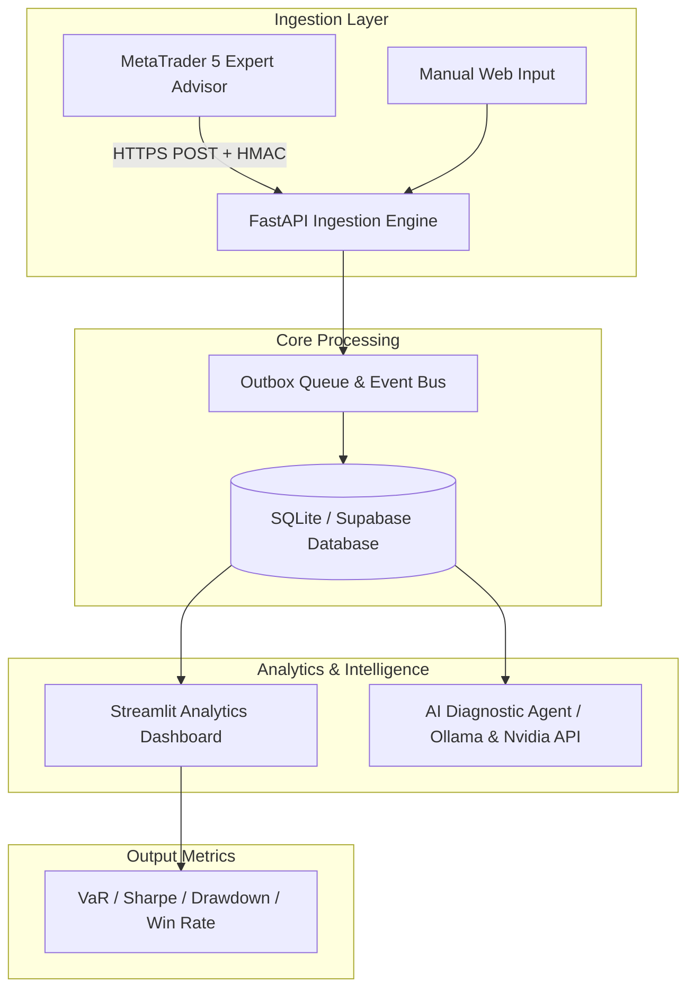

# Quantitative Trading Journal & Operations Platform

[ English ] | [ [Versión en Español](docs/README_ES.md) ]

---

## Executive Summary

> [!NOTE]
> **Core Objective:** Provide an enterprise-grade quantitative operations platform that centralizes trade logging, real-time risk analytics, LLM trade diagnostics, and automated MetaTrader 5 broker synchronization.

| Metric / Dimension        | Specification                                                                  |
| :------------------------ | :----------------------------------------------------------------------------- |
| **Architecture**          | Hybrid FastAPI REST Backend + Streamlit Dashboard + SQLite / Supabase Database |
| **Execution Integration** | MQL5 Expert Advisor Outbox Protocol with HMAC Verification                     |
| **Risk Analytics**        | Real-time Value at Risk (VaR), Sharpe Ratio, Sortino Ratio, Drawdown Tracking  |
| **AI Integration**        | Ollama / Nvidia API / Claude Trade Diagnostic Engine                           |
| **Primary Stack**         | Python 3.12, FastAPI, Streamlit, Peewee ORM, SQLite, Supabase, MQL5, Docker    |

---

## Problem & Solution

- **The Problem:** Systematic traders lack a unified platform that combines trade execution logging, real-time risk analytics, AI-assisted trade auditing, and reliable automated broker synchronization.
- **The Solution:** A modular quantitative operations platform featuring a FastAPI REST backend, interactive Streamlit analytics dashboards, SQLite/Supabase persistence, an outbox queue pattern for MT5 execution, and AI market analyst agents.

---

## System Architecture & Data Flow



---

## Key Features

1. **Automated Trade Ingestion:** Zero-data loss execution logging synced directly from MT5 terminals.
2. **Quantitative Risk Analytics:** Automated calculation of Sharpe Ratio, Sortino Ratio, Maximum Drawdown, and Value at Risk (VaR).
3. **AI Market Analyst Agents:** Integration with local (Ollama) and cloud LLMs for trade performance auditing.
4. **Outbox Queue Pattern:** Decoupled architecture preventing database locks during high-frequency tick updates.

---

## Setup & Installation

```bash
# Clone repository
git clone https://github.com/santiagonaranjofinanzas-droid/Portafolio_Santiago_Naranjo.git
cd Portafolio_Santiago_Naranjo/trading-journal

# Create virtual environment
python -m venv .venv
source .venv/bin/activate  # Windows: .venv\Scripts\activate

# Install dependencies
pip install -r requirements.txt

# Copy environment template
cp .env.example .env

# Run services
python -m uvicorn app.main:app --reload
streamlit run frontend/app.py
```

---

## Disclaimer

> [!WARNING]
> This software is designed for research, backtesting, and trade journal tracking purposes only. It does not constitute financial advice.
