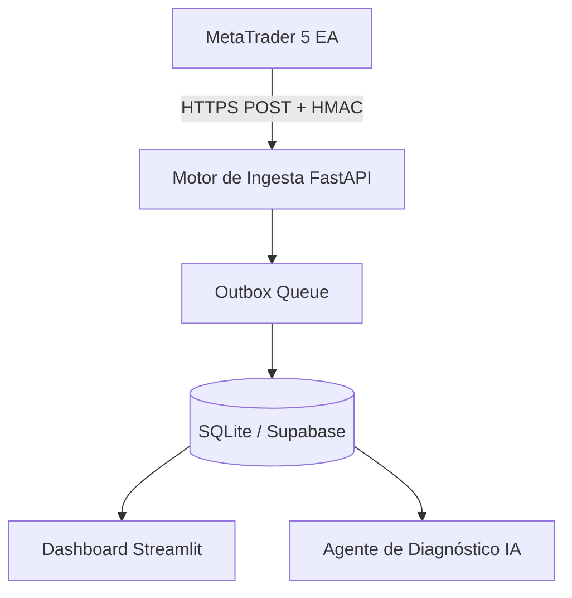

# Plataforma de Journal de Trading Cuantitativo y Operaciones

[ [English Version](../README.md) ] | [ Versión en Español ]

---

## Resumen Ejecutivo

> [!NOTE]
> **Objetivo Principal:** Proveer una plataforma cuantitativa de grado enterprise para centralizar el registro de operaciones, analítica de riesgo en tiempo real, diagnósticos con IA y sincronización automatizada con MetaTrader 5.

| Dimensión                 | Especificación                                                                  |
| :------------------------ | :------------------------------------------------------------------------------ |
| **Arquitectura**          | Backend REST FastAPI + Dashboard en Streamlit + Base de datos SQLite / Supabase |
| **Sincronización Broker** | Protocolo Outbox Queue en MQL5 con verificación HMAC                            |
| **Analítica de Riesgo**   | Value at Risk (VaR), Ratio de Sharpe, Ratio de Sortino, Control de Drawdown     |
| **Integración IA**        | Motor de diagnóstico de operaciones con Ollama / Nvidia API                     |
| **Stack Principal**       | Python 3.12, FastAPI, Streamlit, Peewee ORM, SQLite, Supabase, MQL5, Docker     |

---

## Problema y Solución

- **El Problema:** Los traders cuantitativos carecen de una herramienta unificada que integre el registro de órdenes, el análisis estadístico de rendimiento y la sincronización confiable con el broker.
- **La Solución:** Una plataforma modular con backend en FastAPI, paneles analíticos en Streamlit, persistencia en SQLite/Supabase y un patrón de cola outbox para ejecuciones en MT5.

---

## Arquitectura de Sistema

