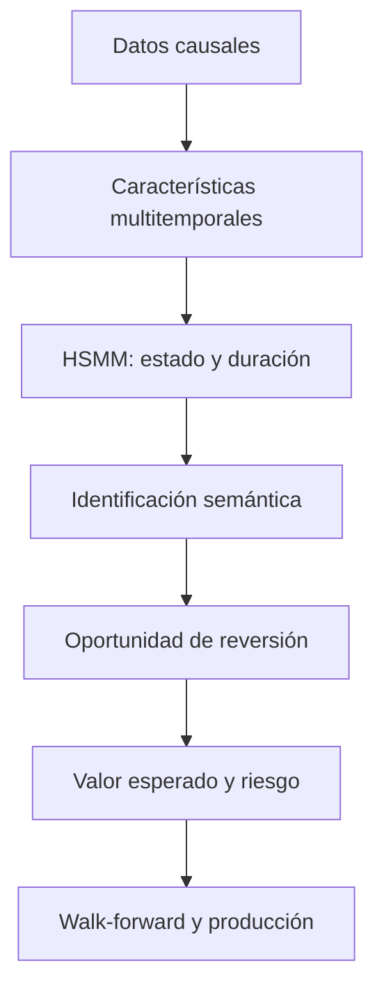

#Plan integral de Quant Research

##Detección probabilística de regímenes de reversión a la media en XAUUSD mediante un Hidden Semi-Markov Model

**Activo principal:** XAUUSD  
**Temporalidad operativa:** M15  
**Contexto multitemporal:** M1/ticks, M15, H1, H4 y D1  
**Tipo de modelo:** Hidden Semi-Markov Model (HSMM) multivariante  
**Versión del protocolo:** 1.0  
**Fecha:** 16 de julio de 2026  
**Estado:** protocolo previo al desarrollo y validación

---

##Resumen ejecutivo

El proyecto busca construir un modelo probabilístico capaz de identificar en tiempo real cuándo XAUUSD se encuentra en un régimen favorable para estrategias de reversión a la media. El modelo principal será un **Hidden Semi-Markov Model (HSMM)**, elegido porque permite representar estados latentes y modelar explícitamente cuánto tiempo tiende a permanecer el mercado en cada régimen.

La salida central será:

\[
P(S_t=\mathrm{MR}\mid\mathcal F_t)
\]

donde \(S_t=\mathrm{MR}\) representa el régimen de reversión a la media y \(\mathcal F_t\) contiene exclusivamente información disponible hasta el instante \(t\).

El proyecto separa dos problemas distintos:

1. **Detección de régimen:** determinar qué dinámica domina el mercado.
2. **Detección de oportunidad:** determinar si existe una desviación operable respecto de un equilibrio y si la operación ofrece valor esperado positivo después de costos.

El HSMM no será aprobado por producir estados visualmente convincentes. Deberá demostrar:

- Probabilidades bien calibradas.
- Duraciones de régimen realistas.
- Estabilidad entre periodos y proveedores.
- Mejora frente a un HMM convencional.
- Valor económico incremental sobre el sistema base.
- Resistencia a costos, slippage, perturbaciones y múltiples pruebas.

---

#1. Planteamiento del problema

Los mercados financieros no mantienen una dinámica constante. XAUUSD puede presentar episodios de tendencia persistente, ruptura, alta volatilidad, lateralidad o reversión a un equilibrio dinámico. Una estrategia contraria aplicada indiscriminadamente puede funcionar durante periodos laterales y sufrir pérdidas severas durante tendencias o rupturas.

El problema central consiste en estimar si las características observadas del mercado permiten inferir un estado latente de reversión con suficiente precisión probabilística y utilidad económica.

El régimen no es directamente observable. Por ello, no se asumirá que una regla como `ADX < 20`, `RSI > 70` o `Hurst < 0.5` constituye la verdad del estado. Los estados serán inferidos por el HSMM y posteriormente interpretados mediante propiedades estadísticas, temporales y económicas predefinidas.

---

#2. Pregunta de investigación

> ¿Puede un HSMM multivariante identificar en tiempo real regímenes persistentes de reversión a la media en XAUUSD M15 y producir probabilidades calibradas que mejoren, fuera de muestra y después de costos, el rendimiento ajustado por riesgo de una estrategia contraria o del sistema de trading base?

---

#3. Objetivos

##3.1 Objetivo general

Construir, estimar y validar un HSMM multivariante que identifique regímenes de reversión a la media en XAUUSD M15, estime su probabilidad y duración en tiempo real y permita filtrar oportunidades de trading con valor esperado neto positivo.

##3.2 Objetivos específicos

1. Construir una base histórica causal y reproducible con precios bid/ask, spread, actividad y variables intermercado.
2. Estimar un equilibrio dinámico del precio mediante un filtro de Kalman y comparar esta alternativa contra benchmarks simples.
3. Desarrollar características estadísticamente distintas relacionadas con memoria, equilibrio, tendencia, volatilidad, liquidez y temporalidad.
4. Estimar un HSMM con emisiones robustas y distribuciones explícitas de duración.
5. Identificar semánticamente los estados latentes sin usar información futura en producción.
6. Estimar probabilidades filtradas de régimen al cierre de cada vela M15.
7. Diseñar una capa separada para detectar oportunidades de reversión mediante desviación, half-life, riesgo de ruptura y costos.
8. Evaluar calibración, discriminación, duración, estabilidad y utilidad económica.
9. Comparar el HSMM contra HMM, reglas simples, modelos AR/OU y el sistema base.
10. Realizar validación walk-forward, pruebas de robustez, ablación y análisis de sobreajuste.
11. Integrar el modelo validado con Python y MT5 para shadow trading antes de autorizar capital real.

---

#4. Hipótesis

##4.1 Hipótesis principal de capacidad predictiva

###Hipótesis nula

\[
H_{0,1}: P(S_t=\mathrm{MR}\mid\mathcal F_t)
\]

no contiene información predictiva incremental sobre la probabilidad de que una desviación del precio retorne a su equilibrio antes de alcanzar una barrera adversa.

Equivalentemente:

\[
P(Y_t=1\mid P_t(\mathrm{MR})\text{ alto})
\le P(Y_t=1)
\]

###Hipótesis alternativa

\[
H_{1,1}:
P(Y_t=1\mid P_t(\mathrm{MR})\text{ alto})
>P(Y_t=1)
\]

donde \(Y_t=1\) significa que una oportunidad contraria alcanza el objetivo de reversión antes del stop y dentro del horizonte establecido.

##4.2 Hipótesis de calibración

###Hipótesis nula

\[
H_{0,2}: \hat p_t=P_t(\mathrm{MR})
\]

no corresponde a la frecuencia observada de reversiones.

###Hipótesis alternativa

\[
H_{1,2}: P(Y_t=1\mid\hat p_t\approx p)\approx p
\]

Por ejemplo, las observaciones clasificadas alrededor de 70% deberían materializar una reversión aproximadamente en 70% de los casos, considerando incertidumbre muestral.

##4.3 Hipótesis económica

###Hipótesis nula

\[
H_{0,3}: E[R_t^{\mathrm{neto}}\mid P_t(\mathrm{MR})>\tau]\le0
\]

###Hipótesis alternativa

\[
H_{1,3}: E[R_t^{\mathrm{neto}}\mid P_t(\mathrm{MR})>\tau]>0
\]

después de spread, comisión, slippage, swap, latencia y restricciones reales de ejecución.

##4.4 Hipótesis incremental

###Hipótesis nula

\[
H_{0,4}: U(\text{sistema base + HSMM})\le U(\text{sistema base})
\]

###Hipótesis alternativa

\[
H_{1,4}: U(\text{sistema base + HSMM})>U(\text{sistema base})
\]

La función \(U\) considerará retorno neto, Sharpe, Sortino, Calmar, drawdown, Expected Shortfall, estabilidad temporal, exposición, rotación y costos.

##4.5 Hipótesis sobre duración

###Hipótesis nula

Un HMM convencional describe las duraciones y transiciones con igual o mejor desempeño fuera de muestra que el HSMM.

###Hipótesis alternativa

El modelado explícito de duración del HSMM reduce cambios espurios, mejora la predicción de permanencia y aumenta el valor económico frente al HMM.

---

#5. Definición operativa de reversión a la media

Se considerará que una observación contiene una oportunidad de reversión cuando:

1. El precio se encuentra suficientemente separado de un equilibrio dinámico.
2. El equilibrio mantiene estabilidad aceptable.
3. La desviación converge dentro del horizonte máximo.
4. El objetivo se alcanza antes de una barrera adversa de ruptura.
5. La vida media estimada es compatible con el horizonte operativo.
6. El beneficio bruto esperado supera los costos de ejecución.

La etiqueta económica se construirá mediante triple barrera:

\[
Y_t=
\begin{cases}
1, & \text{TP alcanzado antes que SL y antes de }H,\\
0, & \text{SL alcanzado antes que TP},\\
\varnothing, & \text{evento no concluyente.}
\end{cases}
\]

##Configuración inicial para investigación

- Activación de evento: \(z_t\ge1.5\).
- Objetivo: retorno a \(z=0.25\) o al equilibrio dinámico.
- Stop: \(z=2.5\), ruptura estructural o múltiplo de ATR.
- Horizonte central: 16 barras M15.
- Horizontes de sensibilidad: 8 y 32 barras.
- Entrada simulada: siguiente precio ejecutable después del cierre de señal.
- Costos: bid/ask real, comisión y slippage.

Estos valores son puntos de partida. No son resultados ni umbrales definitivos.

---

#6. Arquitectura general



##Separación conceptual

 Componente  Pregunta respondida  Resultado 
---------
 HSMM  ¿Qué dinámica domina el mercado?  Probabilidad por estado y duración 
 Equilibrio  ¿Respecto de qué nivel podría revertir?  Media dinámica y residual 
 Capa de oportunidad  ¿Existe una desviación explotable?  Dirección, z-score y half-life 
 Capa económica  ¿Compensa operar después de costos?  EV neto y autorización 
 Gestión de riesgo  ¿Cuánto arriesgar?  Tamaño y límites 

---

#7. Capa 0: gobernanza y control del research

Antes de ajustar el modelo se registrará:

- Hipótesis y variables admitidas.
- Estados candidatos.
- Número de estados probado.
- Distribuciones de emisión y duración.
- Ventanas y horizontes permitidos.
- Métricas principales y secundarias.
- Umbrales de aprobación.
- Número de ensayos realizados.
- Modelos rechazados y motivo.
- Periodos de entrenamiento, calibración y prueba.
- Supuestos de costos.
- Semillas aleatorias.
- Código, datos y versión de configuración.

##Research ledger obligatorio

Cada experimento debe registrar como mínimo:

 Campo  Descripción 
------
 `experiment_id`  Identificador único 
 `timestamp`  Fecha y hora 
 `git_commit`  Versión exacta del código 
 `data_version`  Fuente y versión de datos 
 `feature_set`  Familias y transformaciones 
 `model_spec`  Estados, emisiones y duración 
 `train_period`  Periodo de entrenamiento 
 `validation_period`  Periodo de calibración/validación 
 `test_period`  Bloque OOS 
 `cost_model`  Spread, comisión y slippage 
 `metrics`  Resultados completos 
 `decision`  Aceptado, rechazado o pendiente 
 `reason`  Justificación previa a otro ensayo 

El registro completo será utilizado para calcular Deflated Sharpe Ratio y Probability of Backtest Overfitting.

---

#8. Capa 1: datos

##8.1 Datos mínimos

- Bid y ask de XAUUSD.
- OHLC M15 reconstruido consistentemente.
- Spread observado.
- Tick volume.
- Hora UTC y hora del servidor.
- Calendario de sesiones.
- Días festivos y cierres.
- Rollovers.
- Eventos macroeconómicos, si existe histórico reproducible.

##8.2 Datos preferidos

- Ticks o M1 bid/ask.
- Volumen de futuros de oro COMEX.
- Open interest.
- DXY.
- Treasury yields de 2 y 10 años.
- VIX.
- Volatilidad realizada de futuros de oro.
- Order flow o profundidad si la fuente es estable.

XAUUSD spot/CFD es descentralizado. El volumen del broker suele ser tick volume y no volumen consolidado. Se tratará como medida relativa de actividad, nunca como representación completa del mercado.

##8.3 Auditoría de calidad

- Duplicados.
- Barras faltantes.
- Precios imposibles o spikes.
- Spread anormal.
- Cambios de zona horaria.
- Cambios de proveedor o símbolo.
- Sesiones truncadas.
- Desalineación intermercado.
- Look-ahead por agregación temporal.
- Diferencias entre datos de research y MT5.

##8.4 Regla de causalidad

Toda característica utilizada en la señal de cierre de la barra \(t\) debe poder calcularse únicamente con datos cerrados hasta \(t\). La entrada se simulará en el siguiente precio ejecutable.

---

#9. Capa 2: estimación del equilibrio

##9.1 Benchmark: media robusta o exponencial

Será la referencia simple. Es interpretable, pero puede retrasarse en tendencias.

##9.2 Modelo principal: filtro de Kalman local-level

\[
P_t=\mu_t+\varepsilon_t
\]

\[
\mu_t=\mu_{t-1}+\eta_t
\]

El residual será:

\[
e_t=P_t-\hat\mu_t
\]

y su desviación normalizada:

\[
z_t=\frac{e_t}{\hat\sigma_{e,t}}
\]

##9.3 Extensión: equilibrio intermercado

\[
P_t^{gold}=\alpha_t+\beta_{1,t}DXY_t+\beta_{2,t}Yield_t+\varepsilon_t
\]

Esta versión se probará únicamente después de validar el modelo univariante y si los datos intermercado están correctamente sincronizados.

##9.4 Indicadores de estabilidad del equilibrio

- Varianza de innovación Kalman.
- Pendiente del nivel estimado.
- Cambio de beta, si es multivariante.
- Error medio de predicción.
- Frecuencia de cruces.
- Estabilidad de la half-life.
- Pruebas de cambio estructural.
- Desempeño de reversiones por decil de estabilidad.

---

#10. Capa 3: características

Se partirá de familias económicamente diferentes. No se acumularán osciladores redundantes.

##10.1 Dependencia y memoria

 Característica  Ventanas iniciales  Propósito 
------:---
 ACF de retornos  16, 32, 64  Dependencia negativa o positiva 
 Variance Ratio  4, 8, 16 rezagos  Antipersistencia frente a tendencia 
 AR(1) de retornos  32, 64  Reversión de corto plazo 
 Hurst/DFA  64, 128, 256  Evidencia complementaria 
 Runs statistic  32, 64  Alternancia de signos 

Hurst/DFA será una variable secundaria por su sensibilidad a ventana, ruido y cambios estructurales.

##10.2 Desviación del equilibrio

- Z-score robusto del residual Kalman.
- Distancia al VWAP de sesión.
- Distancia normalizada por ATR.
- Percentil de desviación.
- Tiempo desde el último cruce.
- Número de cruces recientes.
- Pendiente del equilibrio.
- Varianza de innovación.

##10.3 Velocidad de reversión

Para un residual AR(1):

\[
x_t=\alpha+\phi x_{t-1}+\varepsilon_t
\]

La vida media será:

\[
HL=-\frac{\ln 2}{\ln\phi},\qquad 0<\phi<1
\]

Características:

- \(\phi\) AR(1) del residual.
- Velocidad OU \(\kappa\).
- Half-life.
- Variación de half-life.
- Incertidumbre de \(\phi\).
- Error de convergencia.

##10.4 Tendencia y eficiencia

- Kaufman Efficiency Ratio: 16, 32 y 64.
- ADX: 14 y 28.
- Pendiente robusta normalizada.
- \(R^2\) de tendencia.
- Distancia a máximos/mínimos de 20 y 50 barras.
- Coherencia direccional M15-H1-H4.

##10.5 Volatilidad y ruptura

- ATR relativo.
- Realized volatility.
- Parkinson volatility.
- Yang-Zhang cuando las sesiones estén bien definidas.
- Vol-of-vol.
- Ratio de volatilidad corta/larga.
- Rango relativo.
- Jump score.
- Gap.
- Expansión de spread.

##10.6 Liquidez y microestructura

- Spread actual.
- Percentil del spread por hora.
- Tick volume relativo.
- Cambio de actividad.
- Amihud proxy.
- Relación rango/actividad.
- Order-flow imbalance, si existe una fuente fiable.

##10.7 Variables temporales

- Hora UTC codificada con seno/coseno.
- Sesión asiática, Londres, Nueva York y solapamientos.
- Minutos desde apertura.
- Día de la semana.
- Proximidad a rollover.
- Proximidad a noticias de alto impacto.

##10.8 Selección inicial de emisiones

El HSMM comenzará con 8 a 12 variables. La selección priorizará:

- Interpretación económica.
- Baja redundancia.
- Estabilidad entre folds.
- Disponibilidad en producción.
- Ganancia incremental OOS.
- Robustez ante proveedores.

---

#11. Capa 4: especificación del HSMM

##11.1 Estados iniciales

 Estado  Interpretación 
------
 \(S_1\)  Reversión estable 
 \(S_2\)  Tendencia persistente 
 \(S_3\)  Ruptura/alta volatilidad 
 \(S_4\)  Neutral/no operable 

La primera versión no separará tendencia alcista y bajista. La dirección se mantendrá como característica observada. Se probarán 3 y 5 estados como sensibilidad.

##11.2 Emisiones

Propuesta principal:

\[
X_t\mid S_t=s\sim t_{\nu_s}(\mu_s,\Sigma_s)
\]

La Student-t permite representar colas más pesadas que una normal.

Se comparará:

- Normal frente a Student-t.
- Covarianza diagonal.
- Covarianza regularizada.
- Covarianza completa únicamente si hay datos y estabilidad suficientes.

##11.3 Duración

Propuesta principal:

\[
D_s\sim\operatorname{NegBin}(r_s,p_s)
\]

Alternativas:

- Poisson.
- Binomial negativa.
- Lognormal discreta.

La elección considerará log-likelihood OOS, BIC, ajuste de supervivencia, error de duración y estabilidad entre folds.

##11.4 Probabilidades permitidas

En producción:

\[
P(S_t=s\mid X_{1:t})
\]

probabilidad **filtrada**.

No se utilizará para trading:

\[
P(S_t=s\mid X_{1:T})
\]

porque la probabilidad suavizada utiliza observaciones futuras.

Viterbi se reservará para diagnóstico histórico y visualización.

##11.5 Inicialización y convergencia

- Múltiples semillas.
- Inicialización mediante clustering robusto y alternativas aleatorias.
- Mínimo de ocupación por estado.
- Máximo de iteraciones definido.
- Tolerancia de convergencia.
- Registro de log-likelihood.
- Rechazo de soluciones degeneradas.
- Estabilidad de parámetros entre reinicios.

---

#12. Capa 5: identificación semántica de estados

Los estados del HSMM son identificadores matemáticos y pueden intercambiar etiquetas entre estimaciones. Se aplicará una taxonomía predefinida.

Un estado será candidato a `Mean Reversion` si presenta conjuntamente:

- Menor Efficiency Ratio.
- Menor fuerza tendencial.
- Dependencia negativa relativa.
- Half-life finita y compatible.
- Alta frecuencia de retorno al equilibrio.
- Baja tasa de ruptura.
- Resultado contrario positivo en validación.

##Control de label switching

Los estados entre folds se emparejarán mediante distancia entre:

- Centroides de emisiones.
- Volatilidad.
- Persistencia.
- Duración media.
- Frecuencia de reversión.

Se utilizará asignación óptima, por ejemplo Hungarian matching. La interpretación no se redefinirá para maximizar el resultado de cada fold.

---

#13. Capa 6: detección de oportunidad

Condiciones iniciales:

\[
P_t(\mathrm{MR})>\tau_{MR}
\]

\[
z_t>z_{\min}
\]

\[
HL_t<H_{\max}
\]

\[
P_t(\mathrm{breakout})<\tau_B
\]

\[
Spread_t<Spread_{\max}
\]

Dirección:

- \(z_t>0\): candidato short.
- \(z_t<0\): candidato long.

El HSMM podrá estar en reversión sin generar una entrada si el precio está cerca del equilibrio o los costos son excesivos.

---

#14. Capa 7: decisión económica

La operación se autorizará únicamente si:

\[
EV_t=p_tG_t-(1-p_t)L_t-C_t>0
\]

donde:

- \(p_t\): probabilidad de alcanzar TP antes que SL.
- \(G_t\): beneficio esperado.
- \(L_t\): pérdida esperada.
- \(C_t\): costos totales.

El umbral económico mínimo será:

\[
p_t^*=\frac{L_t+C_t}{G_t+L_t}
\]

No se asumirá que 50% es el umbral correcto.

##Gestión de posición

La primera evaluación utilizará tamaño fijo. Solo después de demostrar capacidad predictiva podrá evaluarse:

\[
w_t=w_{\max}f(P_t(\mathrm{MR}),EV_t,\sigma_t)
\]

Esto evita confundir el desempeño del modelo con una optimización agresiva del sizing.

---

#15. Temporalidad

##15.1 Frecuencia principal

**M15** será la frecuencia operativa y de inferencia.

Ventajas:

- Coherencia con el sistema actual.
- Suficiente número de observaciones.
- Menor ruido relativo que M1-M5.
- Captura reversiones intradía.
- Integración viable con MT5.

##15.2 Contexto multitemporal

 Temporalidad  Uso 
------
 Ticks/M1  Reconstrucción, spread y slippage 
 M5  Microestructura opcional 
 M15  HSMM y señal principal 
 H1  Tendencia y volatilidad contextual 
 H4  Régimen estructural lento 
 D1  Contexto de riesgo de fondo 

Las características H1, H4 y D1 usarán únicamente la última vela completamente cerrada.

##15.3 Inferencia

- Una inferencia al cierre de cada M15.
- Ejecución en el siguiente precio disponible.
- Reentrenamiento mensual o trimestral, según estabilidad.
- Parámetros congelados dentro de cada bloque OOS.

##15.4 Horizontes

 Horizonte  Barras M15  Tiempo 
------:---:
 Corto  8  2 horas 
 Principal  16  4 horas 
 Extendido  32  8 horas 

No se mezclarán inicialmente reversiones intradía con operaciones de varios días.

---

#16. Diseño de muestra histórica

Se buscarán datos bid/ask desde 2012 hasta julio de 2026.

 Periodo  Función 
------
 2012-2017  Desarrollo estructural inicial 
 2018-2021  Walk-forward de desarrollo 
 2022-2023  Validación y selección limitada 
 2024-julio 2026  Pseudo-OOS histórico y stress reciente 
 Desde agosto 2026  Shadow/live OOS genuinamente nuevo 

Los datos 2024-2026 no deben describirse como completamente vírgenes porque ya han sido observados en investigaciones previas del sistema.

##Esquema walk-forward inicial

- Entrenamiento: ventana rodante de 4 años.
- Calibración: 6 meses.
- OOS: 3 o 6 meses.
- Actualización: mensual o trimestral.
- Purga: al menos el horizonte máximo de etiqueta.
- Embargo: definido según dependencia y solapamiento.
- Sin optimizar umbrales dentro del bloque OOS.

Sensibilidad:

- Rolling de 3 años.
- Rolling de 4 años.
- Expanding window.

---

#17. Validación y prevención de leakage

##17.1 Reglas

1. Split exclusivamente temporal.
2. Ningún scaler se ajusta con el OOS.
3. Selección de variables dentro del entrenamiento.
4. Kalman y transformaciones estimados causalmente.
5. Probabilidades filtradas.
6. Entrada posterior al cierre de señal.
7. Purga de eventos cuyos horizontes solapan bloques.
8. Calibración independiente del OOS.
9. Datos macro publicados con su fecha real de disponibilidad.
10. Registro de todas las pruebas.

##17.2 Comparación de tres niveles

1. Capacidad estadística del régimen.
2. Calibración probabilística.
3. Utilidad económica incremental.

Un buen resultado en un nivel no sustituye a los otros.

---

#18. Métricas de acierto

##18.1 Calidad probabilística

 Métrica  Interpretación  Criterio orientativo 
---------
 Log-loss  Penaliza probabilidades erróneas y confiadas  Mejor que benchmarks 
 Brier score  Error cuadrático probabilístico  Mejor que HMM y constante 
 Calibration slope  Dispersión correcta  Cercana a 1 
 Calibration intercept  Sesgo global  Cercano a 0 
 ECE  Error de calibración por bins  Preferiblemente < 0.05 
 Reliability diagram  Frecuencia frente a probabilidad  Próxima a diagonal 
 Entropía posterior  Incertidumbre del estado  Estable y no degenerada 

Los valores numéricos son criterios preliminares de aceptación, no promesas de desempeño.

##18.2 Discriminación

- ROC-AUC.
- PR-AUC.
- Precision.
- Recall.
- F1.
- Matthews Correlation Coefficient.
- Balanced Accuracy.

Objetivos orientativos:

- ROC-AUC OOS superior a 0.60.
- PR-AUC al menos 20% superior a la prevalencia.
- MCC superior a 0.15.
- Precision del decil superior materialmente mayor a la base.

La accuracy simple no será una métrica principal.

##18.3 Ordenamiento por deciles

Se agrupará \(P(MR)\) en deciles. Se espera:

\[
E[Y\mid D_{10}]>E[Y\mid D_9]>\cdots>E[Y\mid D_1]
\]

Además se comprobará monotonicidad aproximada de:

- Hit rate.
- Expectancy neta.
- Tiempo de convergencia.
- Frecuencia de stop.
- Maximum Adverse Excursion.
- Maximum Favorable Excursion.

##18.4 Calidad de duración

- MAE de duración restante.
- Error de duración media.
- Concordancia de curvas de supervivencia.
- Cobertura de intervalos.
- Tasa de cambios espurios.
- Ocupación por estado.
- Persistencia por fold.
- Comparación directa HSMM-HMM.

---

#19. Métricas económicas

##19.1 Rendimiento

- Retorno neto anualizado.
- CAGR.
- Profit Factor.
- Expectancy por operación.
- Payoff ratio.
- Hit rate.
- Sharpe.
- Sortino.
- Calmar.
- Omega.
- Recovery Factor.

##19.2 Riesgo

- Maximum Drawdown.
- Duración del drawdown.
- Time Under Water.
- VaR.
- Expected Shortfall.
- Peor día, semana y mes.
- Tail ratio.
- Skewness.
- Kurtosis.
- Máxima pérdida consecutiva.

##19.3 Operabilidad

- Número de operaciones.
- Exposición.
- Rotación.
- Costo medio.
- Slippage.
- Capacidad.
- Resultados por sesión.
- Resultados por año.
- Long frente a short.
- Resultados por nivel de spread.
- Latencia tolerable.

---

#20. Benchmarks

1. Predictor constante basado en prevalencia.
2. Regla simple de z-score.
3. Z-score + ADX.
4. AR(1)/OU móvil.
5. HMM con igual número de estados.
6. Markov-Switching AR.
7. Sistema base sin filtro.
8. Sistema base con filtro HSMM.
9. Buy-and-hold como referencia de exposición, no como competidor intradía directo.

Comparación principal:

\[
\Delta U=U(\text{base+HSMM})-U(\text{base})
\]

---

#21. Robustez

##21.1 Robustez temporal

- Todos los años OOS.
- Periodos de crisis y calma.
- Antes, durante y después de 2020.
- Regímenes de inflación y tasas diferentes.
- Asia, Londres, Nueva York y solapamientos.
- Apertura, cierre y rollover.

##21.2 Robustez paramétrica

- Ventanas ±20%.
- 3, 4 y 5 estados.
- Z-score alternativo.
- Horizontes de 8, 16 y 32 barras.
- Poisson, binomial negativa y lognormal discreta.
- Normal frente a Student-t.
- Covarianza diagonal frente a regularizada.
- Múltiples semillas.

Se buscará una meseta estable, no un óptimo aislado.

##21.3 Robustez de datos

- Al menos dos proveedores, si es viable.
- Bid/ask frente a mid-price.
- Con y sin intermercado.
- Con y sin volumen.
- Eliminación controlada de anomalías.
- Sesiones y zonas horarias alternativas.

##21.4 Robustez económica

- Spread real.
- Spread multiplicado por 1.25, 1.5 y 2.
- Slippage normal y adverso.
- Retraso de entrada.
- Entrada al open siguiente.
- Tamaño fijo.
- Exclusión de las mejores 10 operaciones.
- Exclusión del mejor año.
- Costos por proveedor.

##21.5 Placebos

- Permutación de etiquetas por bloques.
- Desplazamiento temporal de características.
- Estados aleatorios con duración similar.
- Entradas aleatorias con igual frecuencia.
- Comparación contra ADX + z-score.

---

#22. Ablation study

Se retirará una familia por vez:

- Sin dependencia temporal.
- Sin equilibrio.
- Sin volatilidad.
- Sin tendencia.
- Sin liquidez.
- Sin variables temporales.
- Sin contexto H1/H4.
- Sin duración explícita, convirtiéndolo en HMM.

Se medirá el cambio en:

- Brier.
- Log-loss.
- PR-AUC.
- ECE.
- Expectancy.
- Sharpe.
- Drawdown.
- Estabilidad entre folds.

Una familia que empeore consistentemente el OOS será retirada aunque parezca intuitivamente atractiva.

---

#23. Riesgo de sobreajuste

##23.1 Deflated Sharpe Ratio

Se calculará para corregir:

- Selección entre múltiples ensayos.
- No normalidad.
- Longitud de muestra.
- Inflación del Sharpe observado.

##23.2 Probability of Backtest Overfitting

Se estimará mediante CSCV cuando la estructura de candidatos lo permita. Se conservarán todos los modelos probados, no solo los ganadores.

##23.3 Bootstrap

- Stationary/block bootstrap.
- Intervalo de expectancy.
- Intervalo de Sharpe.
- Intervalo de drawdown.
- Distribución de Profit Factor.

El bootstrap debe preservar dependencia temporal razonable.

---

#24. Criterios de aprobación

##24.1 Modelo

- Brier y log-loss mejores que HMM y predictor constante.
- Calibración estable en la mayoría de folds.
- ECE preferiblemente menor a 0.05.
- Deciles altos con mayor reversión y EV.
- Duraciones mejor modeladas que por HMM.
- Sin estados vacíos o degenerados.
- Resultados consistentes entre inicializaciones.

##24.2 Estrategia

- Expectancy neta positiva OOS.
- Profit Factor OOS superior a 1.20.
- Sharpe OOS superior a 1 o mejora material sobre el sistema base.
- Calmar superior al benchmark relevante.
- Resultado positivo en al menos 70% de bloques OOS.
- Ningún año aporta más de 50% del beneficio total.
- Costos ×1.5 no destruyen completamente el alpha.
- Resultado defendible con slippage adverso.

##24.3 Robustez estadística

- DSR con probabilidad superior a 95%.
- PBO preferiblemente inferior a 10-20%.
- Intervalo bootstrap de expectancy predominantemente positivo.
- Estabilidad ante perturbaciones.
- Mejora sobre z-score simple.
- Mejora sobre HMM.
- Mejora incremental sobre el sistema base.

Estos criterios deben evaluarse conjuntamente. No se aprobará el modelo por cumplir solo una métrica.

---

#25. Reglas de decisión del proyecto

##Aprobar para shadow trading

Se cumplen los criterios estadísticos, de calibración, duración, economía y robustez.

##Revisar

Existe señal predictiva, pero falla calibración, costos, estabilidad o integración.

##Descartar

- No supera benchmarks simples.
- El valor depende de un único año.
- El resultado desaparece con costos razonables.
- El HSMM no mejora al HMM.
- Los estados son inestables.
- La ventaja aparece solo después de múltiples optimizaciones.

Descartar el modelo será un resultado válido del research.

---

#26. Integración técnica

##26.1 Research

- Python.
- Datos en Parquet.
- Configuración YAML versionada.
- Entorno reproducible.
- Tests unitarios de causalidad y features.
- Tracking de experimentos.

##26.2 Producción

- Servicio Python para inferencia HSMM.
- Exportación de probabilidades a MT5.
- Validación de timestamps.
- Fallback si faltan datos.
- Logs de entrada y salida.
- Monitoreo de drift.
- Kill switch.

##26.3 Salida por barra

```text
timestamp                 = 2026-08-03 14:30:00 UTC
p_mean_reversion          = 0.78
p_trend                   = 0.09
p_breakout                = 0.07
p_neutral                 = 0.06
expected_regime_bars      = 11
estimated_half_life       = 6
equilibrium_zscore        = 1.84
equilibrium_stability     = 0.81
expected_net_value        = +0.23R
signal_direction          = SHORT
model_confidence          = HIGH
trade_allowed             = TRUE
model_version             = hsmm_xau_m15_v1.0
```

---

#27. Monitoreo en shadow/live

##Indicadores diarios

- Disponibilidad de datos.
- Latencia.
- Spread observado.
- Probabilidades por estado.
- Ocupación de estados.
- Eventos bloqueados.
- Diferencia entre precio esperado y ejecutado.

##Indicadores semanales

- Brier online.
- Calibración por bins.
- Hit rate condicionado.
- Expectancy.
- Drift de features.
- Drift de duración.
- Divergencia de ocupación.
- Slippage real frente al supuesto.

##Alarmas

- Estado con ocupación cercana a cero.
- Probabilidades permanentemente extremas.
- Cambio abrupto en distribución de features.
- Spread fuera de rango.
- Datos desactualizados.
- Pérdida superior a límite.
- Diferencia excesiva entre backtest y ejecución.

---

#28. Cronograma

 Fase  Duración  Entregable 
------:---
 Protocolo y registro  1 semana  Hipótesis y criterios congelados 
 Auditoría de datos  2 semanas  Dataset causal bid/ask 
 Equilibrio y etiquetas  2 semanas  Kalman y triple barrera 
 Features  2 semanas  Matriz causal validada 
 HSMM base  3 semanas  Modelo de cuatro estados 
 Walk-forward  3 semanas  Probabilidades OOS 
 Robustez y ablación  3 semanas  Informe de estabilidad 
 Integración Python-MT5  2 semanas  Inferencia reproducible 
 Shadow trading  8-12 semanas  OOS genuinamente nuevo 
 Decisión final  1 semana  Aprobar, revisar o descartar 

La fase histórica se estima en 15-18 semanas. La evaluación completa requiere además 8-12 semanas de shadow trading.

---

#29. Entregables

1. Protocolo de investigación congelado.
2. Diccionario de datos.
3. Informe de auditoría de datos.
4. Dataset procesado y versionado.
5. Biblioteca causal de características.
6. Modelo de equilibrio Kalman.
7. Generador de etiquetas triple-barrera.
8. Implementación HSMM.
9. Reporte de estados y duración.
10. Backtest walk-forward.
11. Reporte de calibración.
12. Comparación HSMM-HMM.
13. Ablation study.
14. Stress tests.
15. Cálculo de DSR y PBO.
16. Integración con MT5.
17. Dashboard de shadow trading.
18. Informe final y decisión de producción.

---

#30. Riesgos principales

 Riesgo  Consecuencia  Mitigación 
---------
 Estado latente sin verdad observable  Interpretación arbitraria  Taxonomía previa y etiquetas económicas 
 Look-ahead  Backtest artificial  Probabilidades filtradas y tests causales 
 Volumen no consolidado  Señal dependiente del broker  Robustez entre fuentes 
 Demasiadas características  Sobreajuste  8-12 emisiones y ablación 
 Label switching  Estados inconsistentes  Matching entre folds 
 Estado de ruptura confundido con MR  Pérdidas de cola  Estado explícito de ruptura 
 Optimización de umbrales  Inflación de resultados  Ledger, DSR y PBO 
 Diferencia tester-real  Degradación live  Bid/ask, slippage y shadow 
 Drift estructural  Pérdida de validez  Monitoreo y reentrenamiento controlado 
 Complejidad sin valor  Costos operativos  Comparación obligatoria con HMM 

---

#31. Conclusión

El proyecto utilizará un HSMM porque la duración del régimen es parte esencial del problema. La arquitectura no dependerá de un indicador único ni de una clasificación visual. Combinará:

- Estados latentes.
- Duración explícita.
- Equilibrio dinámico.
- Características de memoria, tendencia, volatilidad y liquidez.
- Probabilidades filtradas.
- Etiquetas económicas triple-barrera.
- Validación walk-forward.
- Calibración probabilística.
- Robustez estadística y económica.
- Comparación incremental con el sistema base.

El criterio final no será que el HSMM identifique estados atractivos en un gráfico. Será aprobado únicamente si sus probabilidades están calibradas, las duraciones son estables, los deciles altos concentran reversiones explotables y el modelo mejora el resultado neto fuera de muestra después de costos.

---

#32. Referencias iniciales

- Bailey, D. H., Borwein, J. M., López de Prado, M., & Zhu, Q. J. (2015). *The probability of backtest overfitting*. Journal of Computational Finance. https://papers.ssrn.com/sol3/papers.cfm?abstract_id=2326253
- Bailey, D. H., & López de Prado, M. (2014). *The deflated Sharpe ratio: Correcting for selection bias, backtest overfitting, and non-normality*. https://papers.ssrn.com/sol3/papers.cfm?abstract_id=2460551
- Bulla, J., & Bulla, I. (2006). *Stylized facts of financial time series and hidden semi-Markov models*. Computational Statistics & Data Analysis. https://doi.org/10.1016/j.csda.2006.10.021
- Hamilton, J. D. (1989). *A new approach to the economic analysis of nonstationary time series and the business cycle*. Econometrica, 57(2), 357-384.
- Liu, Z., et al. (2017). *Decoding Chinese stock market returns: Three-state hidden semi-Markov model*. Research in International Business and Finance. https://doi.org/10.1016/j.ribaf.2016.12.007
- Maruotti, A., Petrella, L., & Sposito, L. (2021). *Hidden semi-Markov-switching quantile regression for time series*. Computational Statistics & Data Analysis, 159, 107208. https://doi.org/10.1016/j.csda.2021.107208

---

##Anexo A. Checklist previo a cualquier resultado

- [ ] Hipótesis congeladas.
- [ ] Periodos definidos.
- [ ] Costos definidos.
- [ ] Research ledger habilitado.
- [ ] Datos bid/ask auditados.
- [ ] Features causales verificadas.
- [ ] Etiquetas sin solapamiento indebido.
- [ ] Benchmarks implementados.
- [ ] Métricas y umbrales registrados.
- [ ] OOS protegido.
- [ ] Shadow period definido.

##Anexo B. Checklist previo a producción

- [ ] HSMM supera HMM.
- [ ] Probabilidades calibradas.
- [ ] Duraciones estables.
- [ ] EV neto positivo.
- [ ] Mejora sobre sistema base.
- [ ] DSR aprobado.
- [ ] PBO aceptable.
- [ ] Stress de costos aprobado.
- [ ] Ablation completado.
- [ ] Dos fuentes evaluadas.
- [ ] Integración MT5 validada.
- [ ] Shadow OOS completado.
- [ ] Kill switch probado.
- [ ] Decisión documentada.
